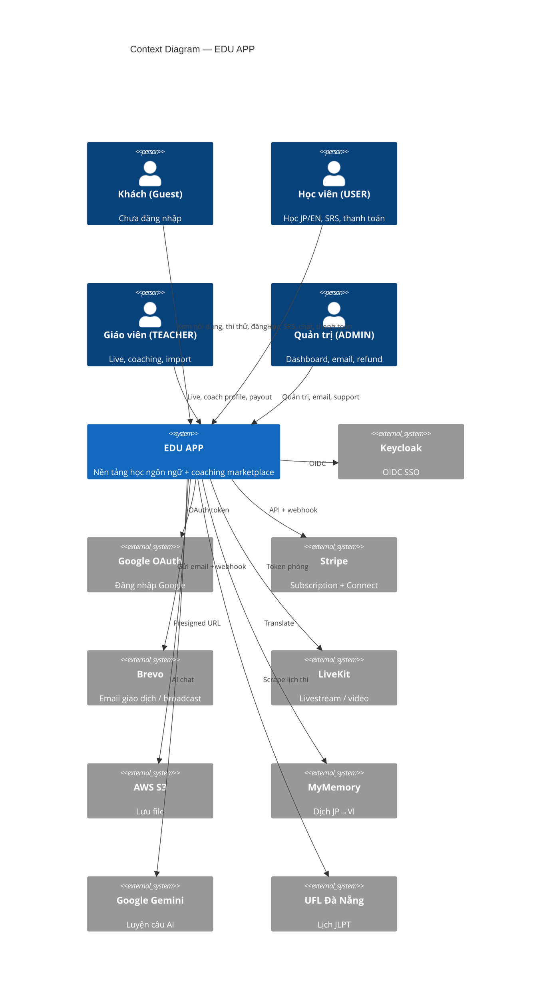
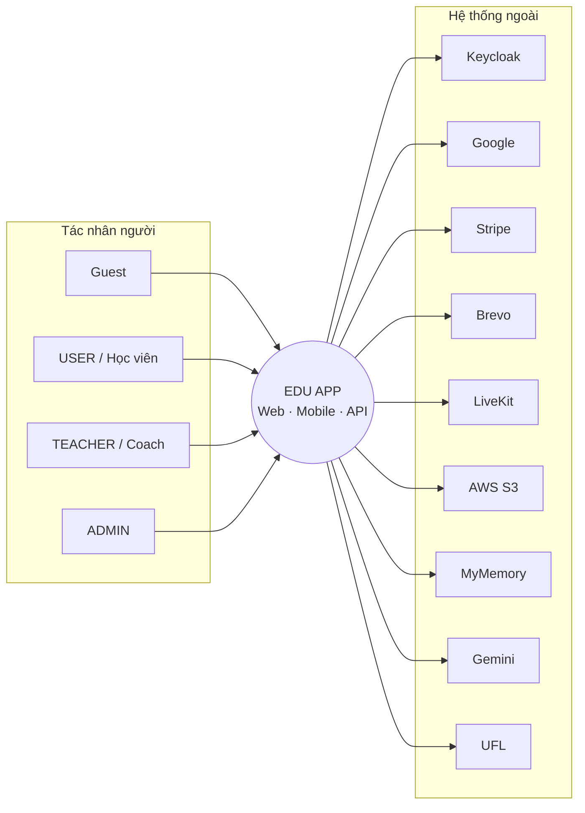
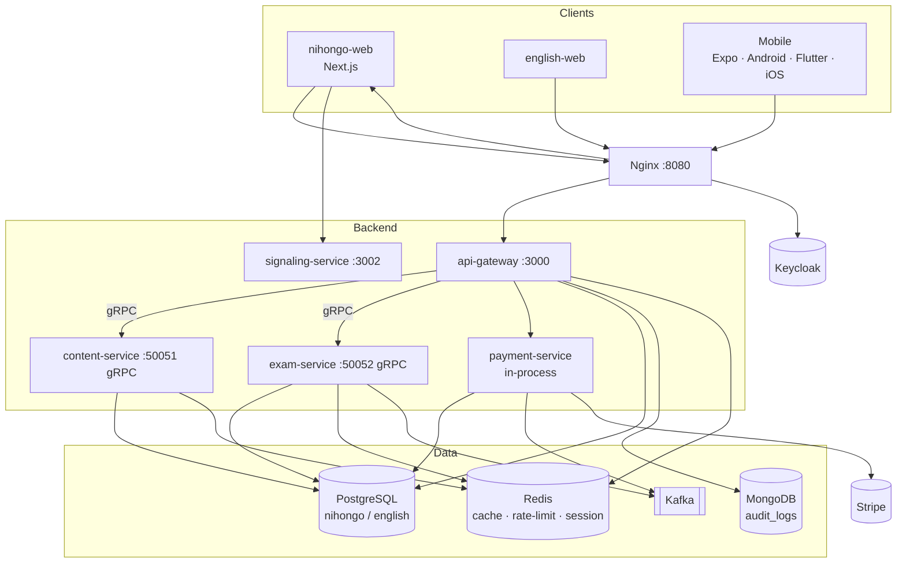
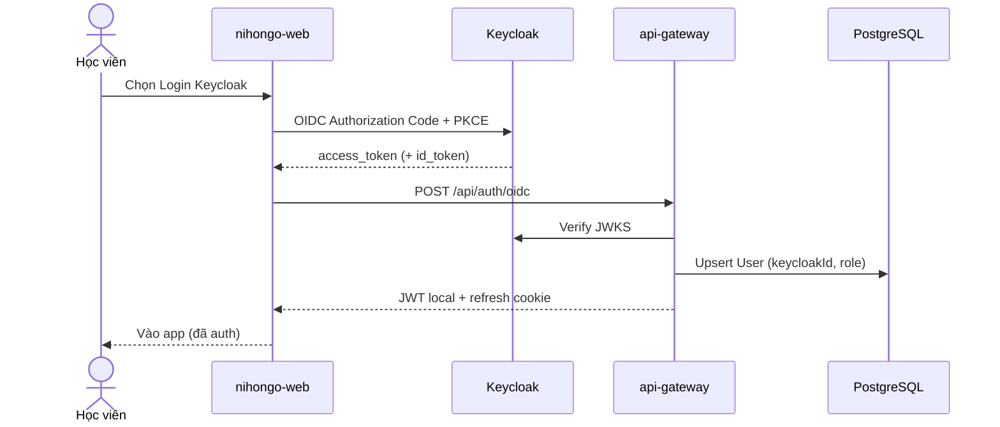
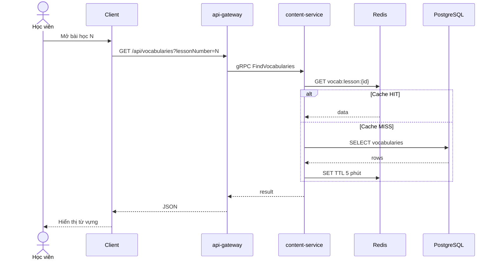
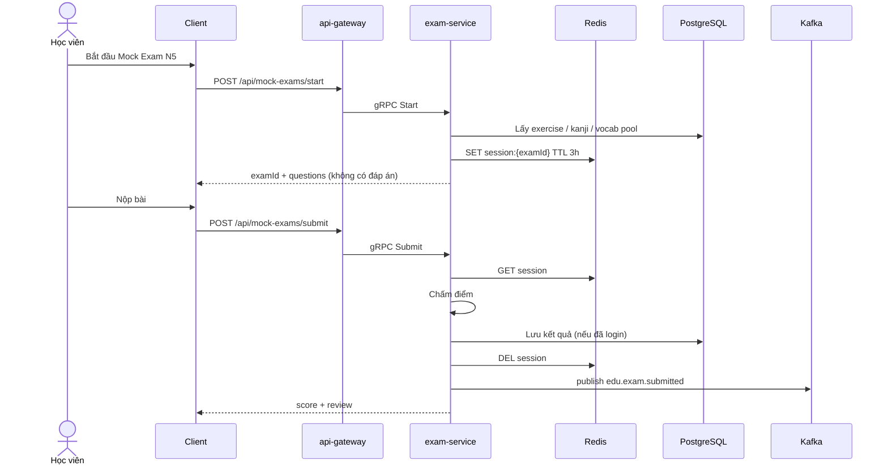
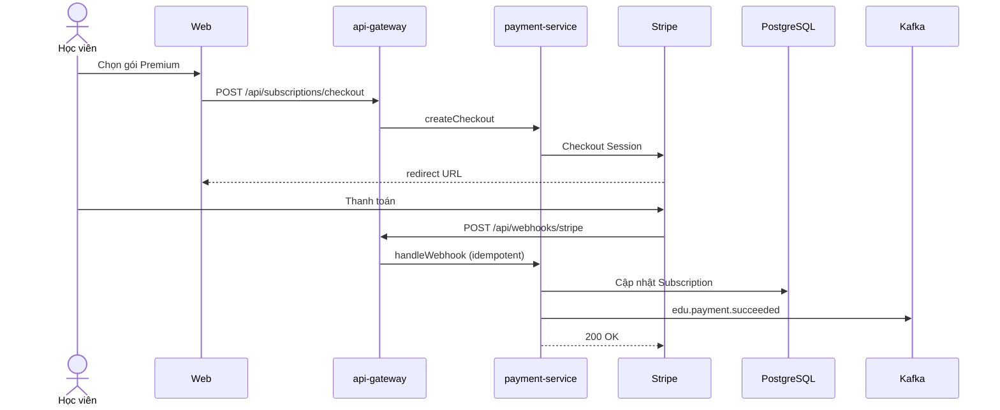
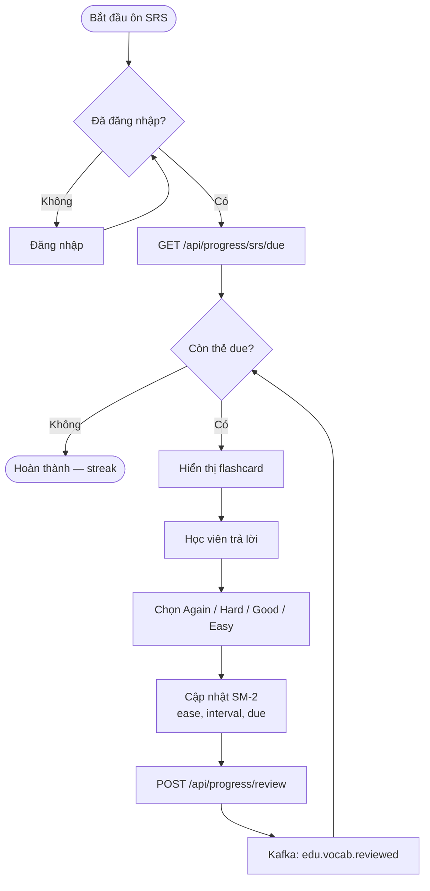
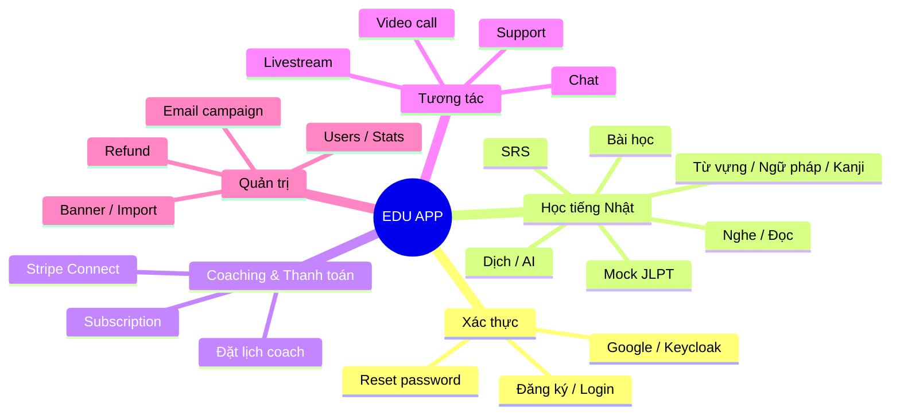

# Phân tích & thiết kế hệ thống thông tin — EDU APP

Tài liệu sơ đồ phục vụ phân tích/thiết kế (SA/SD).

**Báo cáo đầy đủ (2 hướng — Cấu trúc + Hướng đối tượng):** [bao-cao-phan-tich-thiet-ke.md](./bao-cao-phan-tich-thiet-ke.md)

Chi tiết kỹ thuật: [system-design.md](./system-design.md), [db-design.md](./db-design.md).

> Xem trên GitHub/GitLab/VS Code (Mermaid preview).

---

## 1. Biểu đồ ngữ cảnh (Context Diagram)

Hệ thống EDU APP và các tác nhân bên ngoài.



*(Nếu renderer không hỗ trợ C4, xem sơ đồ ASCII ở [system-design.md](./system-design.md).)*



---

## 2. Use Case Diagram — tổng quan

```mermaid
flowchart TB
  subgraph Actors
    Guest((Guest))
    User((USER))
    Teacher((TEACHER))
    Admin((ADMIN))
  end

  subgraph Auth["Xác thực"]
    UC01[UC01 Đăng ký / Đăng nhập]
    UC02[UC02 Đăng nhập Google / Keycloak]
    UC03[UC03 Quên / Đặt lại mật khẩu]
  end

  subgraph Learn["Học tập"]
    UC10[UC10 Xem bài học / từ vựng / ngữ pháp]
    UC11[UC11 Ôn SRS]
    UC12[UC12 Làm bài tập / quiz]
    UC13[UC13 Thi thử JLPT]
    UC14[UC14 Nghe / Đọc hiểu]
    UC15[UC15 Dịch văn bản / camera]
    UC16[UC16 Luyện câu AI]
    UC17[UC17 Xem tiến độ / analytics]
  end

  subgraph Pay["Thanh toán & Coaching"]
    UC20[UC20 Mua / quản lý subscription]
    UC21[UC21 Đặt lịch coaching]
    UC22[UC22 Quản lý thẻ thanh toán]
  end

  subgraph Social["Tương tác"]
    UC30[UC30 Chat cộng đồng / support]
    UC31[UC31 Tham gia livestream]
    UC32[UC32 Video call 1-1]
  end

  subgraph CoachUC["Giáo viên"]
    UC40[UC40 Host livestream]
    UC41[UC41 Quản lý hồ sơ coach / availability]
    UC42[UC42 Stripe Connect / earnings]
    UC43[UC43 Import từ vựng]
  end

  subgraph AdminUC["Quản trị"]
    UC50[UC50 Dashboard / quản lý user]
    UC51[UC51 Refund / xem payments]
    UC52[UC52 Email templates / broadcast]
    UC53[UC53 Support inbox]
    UC54[UC54 Quản lý banner / nội dung]
  end

  Guest --- UC01 & UC02 & UC03 & UC10 & UC13 & UC14 & UC15
  User --- UC01 & UC10 & UC11 & UC12 & UC13 & UC14 & UC15 & UC16 & UC17
  User --- UC20 & UC21 & UC22 & UC30 & UC31 & UC32
  Teacher --- UC40 & UC41 & UC42 & UC43 & UC31
  Admin --- UC50 & UC51 & UC52 & UC53 & UC54 & UC43
```



---

## 3. Use Case Diagram — chi tiết theo nhóm

### 3.1. Auth & Guest

```mermaid
usecaseDiagram
  actor Guest
  actor "Google" as Google
  actor "Keycloak" as Keycloak
  actor "Brevo" as Brevo

  Guesta as Guest

  usecase "UC01 Đăng ký tài khoản" as UC01
  usecase "UC02 Đăng nhập email/password" as UC02
  usecase "UC03 Đăng nhập Google" as UC03
  usecase "UC04 Đăng nhập Keycloak OIDC" as UC04
  usecase "UC05 Quên mật khẩu" as UC05
  usecase "UC06 Đặt lại mật khẩu" as UC06
  usecase "UC07 Xác minh email" as UC07
  usecase "UC10 Xem nội dung học (public)" as UC10
  usecase "UC13 Thi thử JLPT (guest)" as UC13
  usecase "UC15 Dịch / TTS" as UC15
  usecase "UC18 Xem lịch JLPT Đà Nẵng" as UC18

  Guest --> UC01
  Guest --> UC02
  Guest --> UC03
  Guest --> UC04
  Guest --> UC05
  Guest --> UC06
  Guest --> UC07
  Guest --> UC10
  Guest --> UC13
  Guest --> UC15
  Guest --> UC18

  UC03 ..> Google : «include»
  UC04 ..> Keycloak : «include»
  UC05 ..> Brevo : «include»
  UC07 ..> Brevo : «include»
```

### 3.2. Học viên (USER)

```mermaid
usecaseDiagram
  actor USER as "Học viên\n(USER)"
  actor Stripe
  actor LiveKit
  actor Gemini
  actor MyMemory

  usecase "UC11 Ôn tập SRS" as UC11
  usecase "UC12 Làm quiz / bài tập" as UC12
  usecase "UC13 Thi thử JLPT" as UC13
  usecase "UC14 Luyện nghe / đọc" as UC14
  usecase "UC15 Dịch camera / văn bản" as UC15
  usecase "UC16 Luyện câu với AI" as UC16
  usecase "UC17 Xem tiến độ & analytics" as UC17
  usecase "UC20 Mua subscription" as UC20
  usecase "UC21 Đặt / hủy buổi coaching" as UC21
  usecase "UC22 Quản lý payment method" as UC22
  usecase "UC23 Xem lịch sử thanh toán" as UC23
  usecase "UC30 Chat cộng đồng / DM" as UC30
  usecase "UC31 Tham gia livestream" as UC31
  usecase "UC32 Video call 1-1" as UC32
  usecase "UC33 Chat hỗ trợ" as UC33
  usecase "UC34 Cập nhật hồ sơ / email prefs" as UC34

  USER --> UC11
  USER --> UC12
  USER --> UC13
  USER --> UC14
  USER --> UC15
  USER --> UC16
  USER --> UC17
  USER --> UC20
  USER --> UC21
  USER --> UC22
  USER --> UC23
  USER --> UC30
  USER --> UC31
  USER --> UC32
  USER --> UC33
  USER --> UC34

  UC15 ..> MyMemory : «include»
  UC16 ..> Gemini : «include»
  UC20 ..> Stripe : «include»
  UC21 ..> Stripe : «include»
  UC22 ..> Stripe : «include»
  UC31 ..> LiveKit : «include»
  UC32 ..> LiveKit : «include»
```

### 3.3. Giáo viên (TEACHER) & Admin

```mermaid
usecaseDiagram
  actor TEACHER as "Giáo viên\n(TEACHER)"
  actor ADMIN as "Quản trị\n(ADMIN)"
  actor Stripe
  actor LiveKit
  actor Brevo

  usecase "UC40 Host livestream" as UC40
  usecase "UC41 Quản lý coach profile" as UC41
  usecase "UC42 Onboard Stripe Connect / xem earnings" as UC42
  usecase "UC43 Import từ vựng" as UC43

  usecase "UC50 Dashboard thống kê" as UC50
  usecase "UC51 Refund / audit payments" as UC51
  usecase "UC52 Email template / broadcast" as UC52
  usecase "UC53 Support inbox" as UC53
  usecase "UC54 Quản lý banner / nội dung" as UC54
  usecase "UC55 Worksheet / certificate tools" as UC55

  TEACHER --> UC40
  TEACHER --> UC41
  TEACHER --> UC42
  TEACHER --> UC43

  ADMIN --> UC50
  ADMIN --> UC51
  ADMIN --> UC52
  ADMIN --> UC53
  ADMIN --> UC54
  ADMIN --> UC55
  ADMIN --> UC43

  UC40 ..> LiveKit : «include»
  UC42 ..> Stripe : «include»
  UC51 ..> Stripe : «include»
  UC52 ..> Brevo : «include»
```

---

## 4. Ma trận Use Case ↔ Service

| UC | Mô tả ngắn | Service chính | Client |
|----|------------|---------------|--------|
| UC01–07 | Auth | api-gateway + Keycloak/Brevo | Web, Mobile |
| UC10 | Nội dung học | content-service | Web, Mobile |
| UC11, UC17 | SRS / progress | exam-service | Web, Mobile |
| UC13 | Mock exam | exam-service | Web, Mobile |
| UC15 | Translate | api-gateway → MyMemory | Web, Mobile |
| UC16 | AI chat | api-gateway → Gemini | Web, Mobile |
| UC20–23 | Payment | payment-service → Stripe | Web |
| UC30–33 | Chat / support | api-gateway realtime | Web |
| UC31–32, UC40 | Live / video | LiveKit + signaling | Web, Mobile |
| UC41–42 | Coach | payment-service | Web |
| UC50–55 | Admin | api-gateway + web admin | nihongo-web |

---

## 5. Kiến trúc thành phần (Component / Deployment)



---

## 6. Sequence Diagram — luồng chính

### 6.1. Đăng nhập Keycloak → JWT local



### 6.2. Xem từ vựng (có Redis cache)



### 6.3. Thi thử JLPT (mock exam)



### 6.4. Mua subscription (Stripe)



---

## 7. Activity Diagram — ôn SRS



---

## 8. Biểu đồ phân cấp chức năng (FHD — tóm tắt)



---

## 9. Ma trận phân quyền (RBAC)

| Chức năng | Guest | USER | TEACHER | ADMIN |
|-----------|:-----:|:----:|:-------:|:-----:|
| Xem nội dung public | ✓ | ✓ | ✓ | ✓ |
| SRS / progress | | ✓ | ✓ | ✓ |
| Subscription / booking | | ✓ | ✓ | ✓ |
| Community / support chat | | ✓ | ✓ | ✓ |
| Join live | ✓* | ✓ | ✓ | ✓ |
| Host live | | | ✓ | ✓ |
| Coach profile / Connect | | | ✓ | ✓ |
| Import vocab | | | ✓ | ✓ |
| Admin dashboard / refund / email | | | | ✓ |
| Support inbox | | | | ✓ |

\*Guest có thể xem danh sách live; join đầy đủ thường cần JWT.

---

## 10. Đặc tả Use Case mẫu (UC11 — Ôn SRS)

| Mục | Nội dung |
|-----|----------|
| **Tên** | UC11 — Ôn tập SRS |
| **Tác nhân chính** | USER (Học viên) |
| **Mức** | User goal |
| **Tiền điều kiện** | Đã đăng nhập; có thẻ trong hàng đợi SRS (hoặc thêm từ bài học) |
| **Hậu điều kiện** | Cập nhật `dueDate`, `ease`, `interval`; có thể tăng streak |
| **Luồng chính** | 1. Mở màn SRS → 2. Hệ thống trả thẻ due → 3. Học viên trả lời → 4. Chọn mức nhớ → 5. SM-2 cập nhật → 6. Lặp đến hết hàng đợi |
| **Ngoại lệ** | Offline (mobile): ghi local queue, sync khi có mạng |
| **Service** | `exam-service` qua `api/progress/srs*` |

---

## 11. Tài liệu liên quan

| File | Nội dung |
|------|----------|
| [system-design.md](./system-design.md) | Kiến trúc & request flows |
| [db-design.md](./db-design.md) | ER / schema PostgreSQL |
| [accounts.md](./accounts.md) | Tài khoản demo theo role |
| [nginx.md](./nginx.md) | Cổng vào reverse proxy |
| [mongodb.md](./mongodb.md) | Audit log |
| [brevo-mail.md](./brevo-mail.md) | Email |
| [keycloak-setup.md](./keycloak-setup.md) | OIDC roles |
