# BÁO CÁO PHÂN TÍCH & THIẾT KẾ HỆ THỐNG THÔNG TIN

## Hệ thống EDU APP — Nền tảng học ngôn ngữ & Coaching Marketplace

| Mục | Nội dung |
|-----|----------|
| **Tên hệ thống** | EDU APP (Nihongo Learning + Coaching) |
| **Phạm vi** | Web (nihongo-web, english-web), Mobile (Expo / Android / Flutter / iOS), Backend NestJS |
| **Phương pháp** | Phân tích theo **hai hướng**: Cấu trúc (SSADM-style) và Hướng đối tượng (UML) |
| **Tài liệu kỹ thuật** | [system-design.md](./system-design.md), [db-design.md](./db-design.md), [analysis-design.md](./analysis-design.md) |

> Sơ đồ dùng **Mermaid** — xem preview trong VS Code / Cursor / GitHub / GitLab.

---

# PHẦN A — GIỚI THIỆU HỆ THỐNG

## A.1. Mục tiêu

Xây dựng nền tảng hỗ trợ:

1. Học tiếng Nhật (bài học, từ vựng, ngữ pháp, kanji, nghe, đọc, SRS, thi thử JLPT).
2. Marketplace coaching 1-1 (đặt lịch, thanh toán Stripe, livestream LiveKit).
3. Đa kênh: web + mobile, xác thực JWT / Google / Keycloak.
4. Quản trị: user, email (Brevo), refund, support inbox.

## A.2. Tác nhân (Actors)

| Tác nhân | Mô tả |
|----------|--------|
| **Guest** | Chưa đăng nhập — xem nội dung public, thi thử, đăng ký |
| **USER (Học viên)** | Học, SRS, subscription, chat, live, coaching |
| **TEACHER (Coach)** | Host live, hồ sơ coach, Stripe Connect, import vocab |
| **ADMIN** | Dashboard, refund, email campaign, support |
| **Hệ thống ngoài** | Keycloak, Google, Stripe, Brevo, LiveKit, S3, MyMemory, Gemini, UFL |

## A.3. Cách trình bày báo cáo

| Hướng | Ký hiệu | Sơ đồ |
|-------|---------|--------|
| **Hướng cấu trúc** | Phần B | BFD (phân cấp chức năng), DFD (luồng dữ liệu), ERD (thực thể–quan hệ) |
| **Hướng đối tượng** | Phần C | Use Case, Activity, Class, Sequence, State Machine |
| **Đối chiếu & kết luận** | Phần D | Ánh xạ sơ đồ → code |
| **Phỏng vấn / bảo vệ** | Phần E | Câu hỏi + gợi ý trả lời gắn báo cáo & codebase |

---

# PHẦN B — HƯỚNG CẤU TRÚC

Phân tích theo góc nhìn **chức năng → dữ liệu**: hệ thống là tập tiến trình xử lý luồng dữ liệu giữa kho dữ liệu và tác nhân.

---

## B.1. Sơ đồ phân cấp chức năng (BFD — Function Hierarchy Diagram)

### B.1.1. Cây chức năng tổng quát

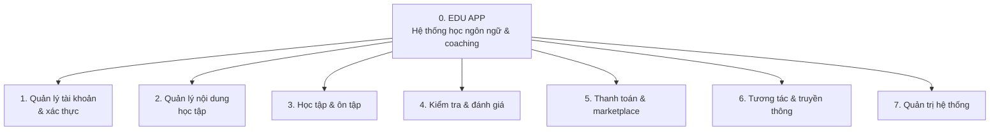

### B.1.2. Phân rã chi tiết (cấp 2–3)

```mermaid
flowchart TB
  F1["1. Quản lý tài khoản"]
  F1 --> F11["1.1 Đăng ký"]
  F1 --> F12["1.2 Đăng nhập<br/>email / Google / Keycloak"]
  F1 --> F13["1.3 Quên / đặt lại mật khẩu"]
  F1 --> F14["1.4 Xác minh email"]
  F1 --> F15["1.5 Cập nhật hồ sơ / preference"]

  F2["2. Quản lý nội dung"]
  F2 --> F21["2.1 Bài học Minna"]
  F2 --> F22["2.2 Từ vựng"]
  F2 --> F23["2.3 Ngữ pháp + ví dụ"]
  F2 --> F24["2.4 Kanji / Kana"]
  F2 --> F25["2.5 Nghe / Đọc / Dictation"]
  F2 --> F26["2.6 Import nội dung Teacher/Admin"]

  F3["3. Học tập & ôn tập"]
  F3 --> F31["3.1 Xem bài học"]
  F3 --> F32["3.2 Ôn SRS SM-2"]
  F3 --> F33["3.3 Luyện nghe / đọc"]
  F3 --> F34["3.4 Dịch JP↔VI / camera"]
  F3 --> F35["3.5 Luyện câu AI Gemini"]
  F3 --> F36["3.6 Theo dõi tiến độ / streak"]

  F4["4. Kiểm tra & đánh giá"]
  F4 --> F41["4.1 Bài tập / quiz"]
  F4 --> F42["4.2 Thi thử JLPT mock"]
  F4 --> F43["4.3 Lưu ExamResult"]
  F4 --> F44["4.4 Analytics học tập"]

  F5["5. Thanh toán & marketplace"]
  F5 --> F51["5.1 Xem / mua Subscription"]
  F5 --> F52["5.2 Quản lý thẻ Stripe"]
  F5 --> F53["5.3 Đặt / hủy CoachingSession"]
  F5 --> F54["5.4 Coach profile & availability"]
  F5 --> F55["5.5 Stripe Connect / Payout"]
  F5 --> F56["5.6 Webhook & Refund Admin"]

  F6["6. Tương tác"]
  F6 --> F61["6.1 Chat cộng đồng / DM"]
  F6 --> F62["6.2 Support chat"]
  F6 --> F63["6.3 Livestream LiveKit"]
  F6 --> F64["6.4 Video call 1-1"]
  F6 --> F65["6.5 Push / Notification"]

  F7["7. Quản trị"]
  F7 --> F71["7.1 Dashboard / Users"]
  F7 --> F72["7.2 Email template / broadcast"]
  F7 --> F73["7.3 Banner trang"]
  F7 --> F74["7.4 Support inbox"]
  F7 --> F75["7.5 Audit log MongoDB"]
```

### B.1.3. Diễn giải BFD

| Mã | Chức năng | Người thực hiện chính |
|----|-----------|------------------------|
| 1.x | Tài khoản | Guest, USER |
| 2.x | Nội dung | Hệ thống (seed) + TEACHER/ADMIN (import/CRUD) |
| 3.x–4.x | Học & thi | USER, Guest (một phần) |
| 5.x | Tiền & coach | USER, TEACHER, ADMIN, Stripe |
| 6.x | Xã hội / realtime | USER, TEACHER, ADMIN |
| 7.x | Vận hành | ADMIN |

---

## B.2. Biểu đồ luồng dữ liệu (DFD — Data Flow Diagram)

### B.2.1. DFD mức ngữ cảnh (Level 0)

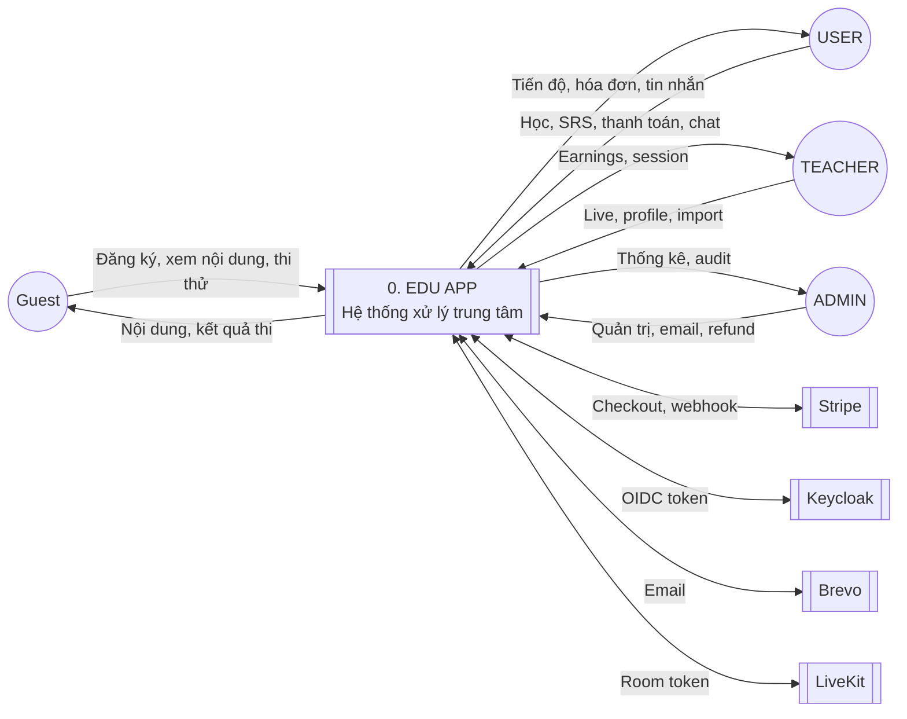

### B.2.2. DFD mức 1 — phân rã tiến trình chính

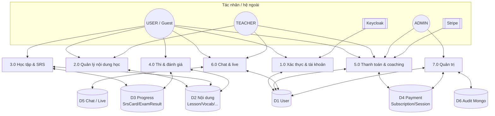

### B.2.3. DFD mức 2 — tiến trình 3.0 Học tập & SRS (chi tiết)

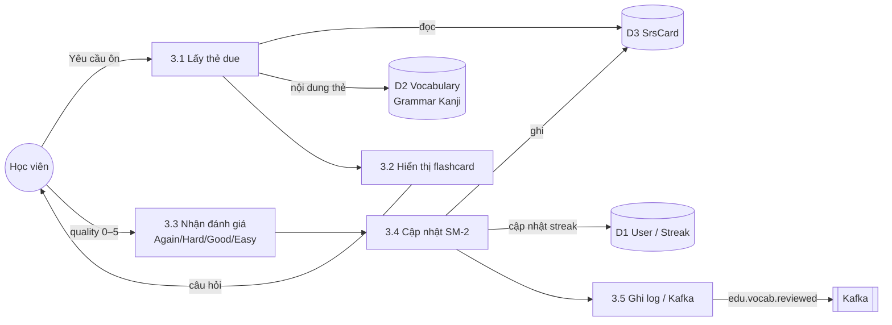

### B.2.4. Từ điển dữ liệu (rút gọn)

| Kho dữ liệu | Nội dung chính | Lưu trữ |
|-------------|----------------|---------|
| D1 User | User, RefreshToken, EmailPrefs, Role | PostgreSQL `nihongo` |
| D2 Nội dung | Lesson, Vocabulary, Grammar, Kanji, Exercise… | PostgreSQL |
| D3 Progress | SrsCard, ExamResult, StudyStreak, ListeningLog | PostgreSQL |
| D4 Payment | Subscription, Payment, CoachProfile, CoachingSession | PostgreSQL |
| D5 Chat/Live | SupportThread, LearnerChat*, LiveSession | PostgreSQL + LiveKit |
| D6 Audit | audit_logs | MongoDB TTL 90 ngày |
| Cache | vocab/lesson list, mock exam session | Redis |

### B.2.5. Nhận xét DFD

- Luồng **đồng bộ** (REST/gRPC) cho học tập; **bất đồng bộ** (Kafka webhook) cho payment/exam.
- Redis giảm tải đọc D2; không thay thế kho dữ liệu chính.
- Guest chỉ đọc D2 + ghi tạm session thi (Redis), không bắt buộc D1.

---

## B.3. Mô hình thực thể–kết hợp (ERD — Entity Relationship Diagram)

### B.3.1. ERD tổng quan (lõi nghiệp vụ)

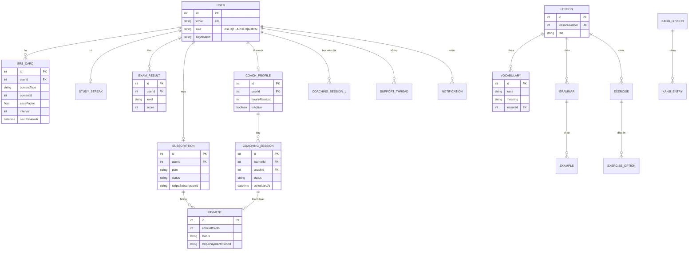

### B.3.2. ERD phân hệ nội dung học

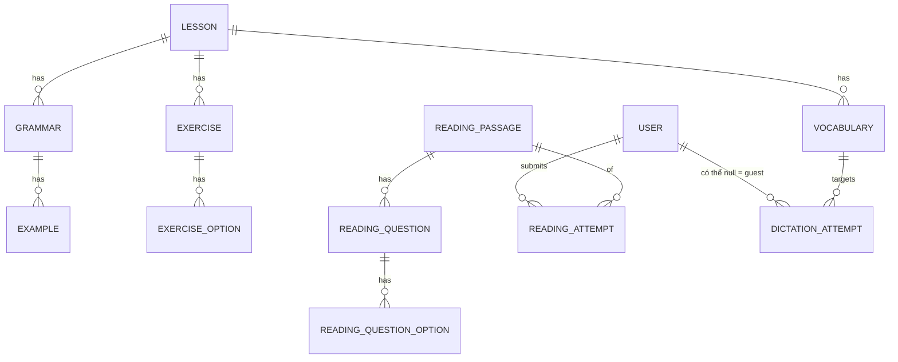

### B.3.3. ERD phân hệ thanh toán & coaching

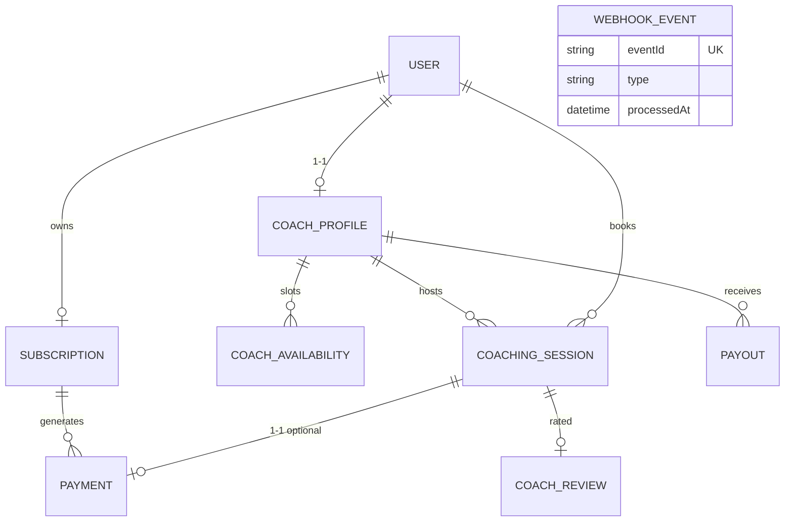

### B.3.4. Quan hệ & ràng buộc chính

| Quan hệ | Bản số | Ràng buộc |
|---------|--------|-----------|
| User–Subscription | 1:0..1 | Unique `userId` |
| User–CoachProfile | 1:0..1 | Unique `userId` |
| User–SrsCard | 1:N | Unique `(userId, contentType, contentId)` |
| Lesson–Vocabulary | 1:N | FK `lessonId` |
| CoachingSession–Payment | 1:0..1 | Snapshot `priceUsdCents` lúc book |
| Subscription.status | — | ACTIVE / PAST_DUE / CANCELED / TRIALING / PAUSED |

### B.3.5. Ghi chú thiết kế dữ liệu

- **PostgreSQL** = nguồn sự thật nghiệp vụ.
- **MongoDB** = audit append-only, TTL 90 ngày (không vào ERD quan hệ).
- **Redis** = cache / session thi — không phải thực thể bền vững.

Chi tiết schema: [db-design.md](./db-design.md).

---

# PHẦN C — HƯỚNG ĐỐI TƯỢNG (UML)

Phân tích theo góc nhìn **đối tượng–tương tác**: lớp, hành vi, trạng thái và thông điệp theo thời gian.

---

## C.1. Sơ đồ Use Case (Use Case Diagram)

Use Case mô tả **ai sử dụng hệ thống** và **họ đạt mục tiêu gì**, không mô tả chi tiết cách triển khai.

### C.1.1. Use Case tổng quan toàn hệ thống

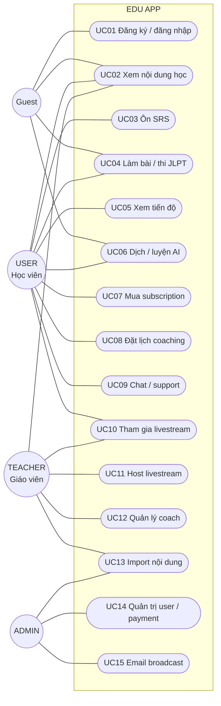

### C.1.2. Use Case — Guest và xác thực

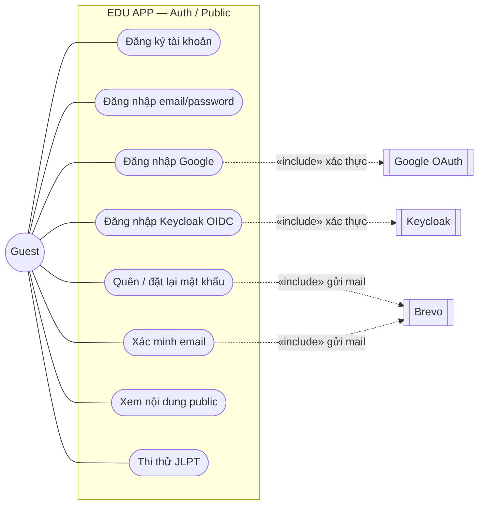

### C.1.3. Use Case — Học viên

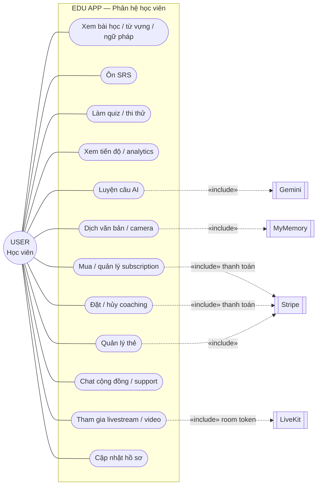

### C.1.4. Use Case — Giáo viên và Admin

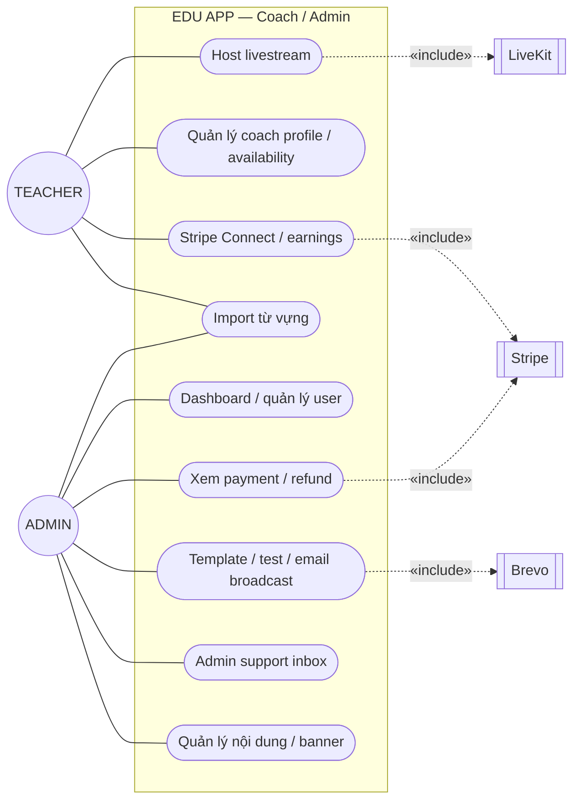

### C.1.5. Quan hệ tác nhân và phân quyền

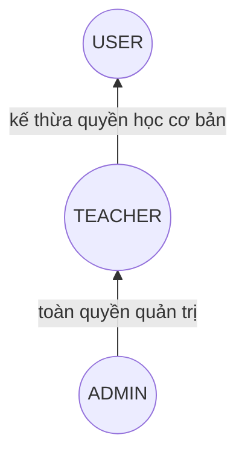

| Nhóm Use Case | Guest | USER | TEACHER | ADMIN |
|---------------|:-----:|:----:|:-------:|:-----:|
| Auth / nội dung public / guest exam | ✓ | ✓ | ✓ | ✓ |
| SRS / progress / subscription / booking | | ✓ | ✓* | ✓* |
| Host live / coach profile / import | | | ✓ | ✓ |
| Dashboard / refund / email / support inbox | | | | ✓ |

\*TEACHER và ADMIN vẫn có tài khoản User nên có thể dùng chức năng học; các endpoint nhạy cảm vẫn kiểm tra role cụ thể.

### C.1.6. Danh mục Use Case

| Mã | Tên Use Case | Tác nhân chính | Tiền điều kiện | Kết quả |
|----|--------------|----------------|----------------|---------|
| UC01 | Đăng ký / đăng nhập | Guest | Có email hoặc tài khoản OIDC | Nhận JWT + refresh token |
| UC02 | Xem nội dung học | Guest/USER | Nội dung đã được publish | Hiển thị lesson/vocab/grammar |
| UC03 | Ôn SRS | USER | Đăng nhập, có SrsCard | Cập nhật SM-2 và streak |
| UC04 | Thi thử JLPT | Guest/USER | Chọn cấp độ hỗ trợ | Trả điểm; lưu kết quả nếu login |
| UC05 | Xem tiến độ | USER | Đăng nhập | Analytics, streak, thẻ due |
| UC06 | Dịch / AI | Guest/USER | Nội dung đầu vào hợp lệ | Bản dịch hoặc phản hồi AI |
| UC07 | Mua subscription | USER | Đăng nhập | Checkout Stripe / sub cập nhật |
| UC08 | Đặt coaching | USER | Coach/slot hợp lệ | Session + payment |
| UC09 | Chat / support | USER | Đăng nhập | Lưu và nhận tin nhắn |
| UC10 | Tham gia live | USER | Live đang mở | Token tham gia phòng |
| UC11 | Host livestream | TEACHER | Role teacher | LiveSession được tạo |
| UC12 | Quản lý coach | TEACHER | Coach profile | Availability / earnings |
| UC13 | Import nội dung | TEACHER/ADMIN | File hợp lệ | Nội dung DB + xoá cache |
| UC14 | Quản trị user/payment | ADMIN | Role admin | Thống kê / refund |
| UC15 | Email broadcast | ADMIN | Template + audience | Campaign queued/sent |

### C.1.7. Đặc tả Use Case UC03 — Ôn SRS

| Thuộc tính | Nội dung |
|------------|----------|
| **Tác nhân chính** | USER |
| **Mục tiêu** | Ôn các nội dung đến hạn bằng thuật toán SM-2 |
| **Tiền điều kiện** | User đã đăng nhập; có thẻ due hoặc đã thêm bài học |
| **Kích hoạt** | User mở màn hình ôn SRS |
| **Luồng chính** | (1) Hệ thống lấy thẻ due → (2) Hiển thị flashcard → (3) User trả lời → (4) Chọn chất lượng 0–5 → (5) Tính interval/ease/nextReviewAt → (6) Lưu → (7) Lặp đến hết |
| **Luồng thay thế** | Mobile offline: lưu review vào local queue, đồng bộ khi có mạng |
| **Ngoại lệ** | Token hết hạn → refresh/login; nội dung bị xoá → bỏ qua thẻ |
| **Hậu điều kiện** | SrsCard và StudyStreak được cập nhật |

### C.1.8. Đặc tả Use Case UC08 — Đặt lịch coaching

| Thuộc tính | Nội dung |
|------------|----------|
| **Tác nhân chính** | USER; phụ: Stripe, TEACHER |
| **Mục tiêu** | Đặt và thanh toán một buổi học 1-1 |
| **Tiền điều kiện** | User đăng nhập; coach active; slot còn trống |
| **Luồng chính** | (1) Tìm coach → (2) Chọn slot → (3) Kiểm tra conflict → (4) Tạo PENDING session → (5) Stripe thanh toán → (6) Webhook xác nhận → (7) Session thành CONFIRMED |
| **Luồng thay thế** | Thanh toán lỗi → FAILED/CANCELED; slot trùng → chọn slot khác |
| **Hậu điều kiện** | CoachingSession và Payment được lưu nhất quán |

---

## C.2. Sơ đồ hoạt động (Activity Diagram)

### C.2.1. Activity — Quy trình ôn SRS (UC03)

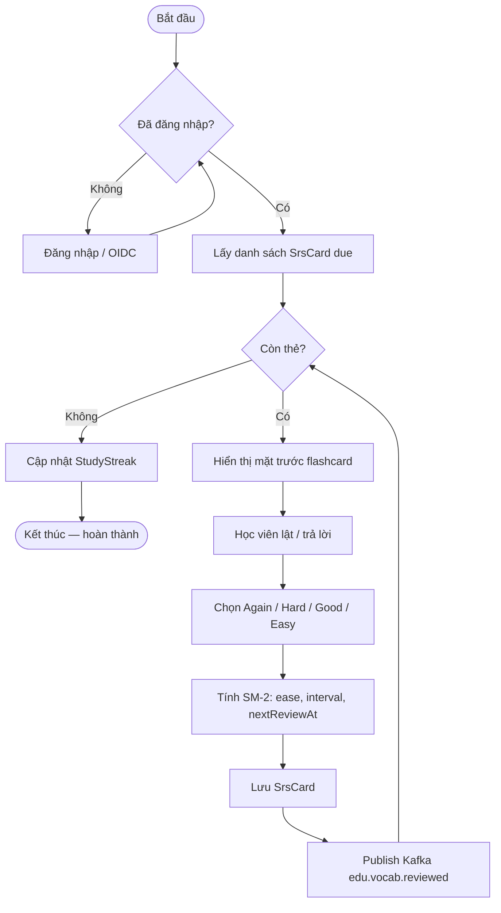

### C.2.2. Activity — Đặt lịch coaching + thanh toán

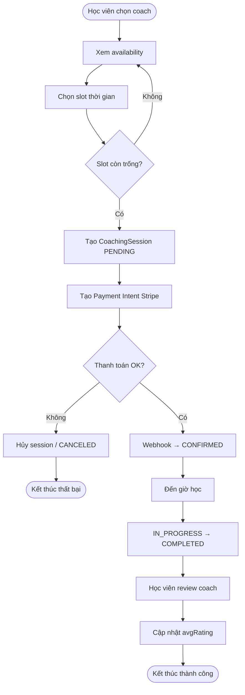

### C.2.3. Activity — Admin gửi email broadcast

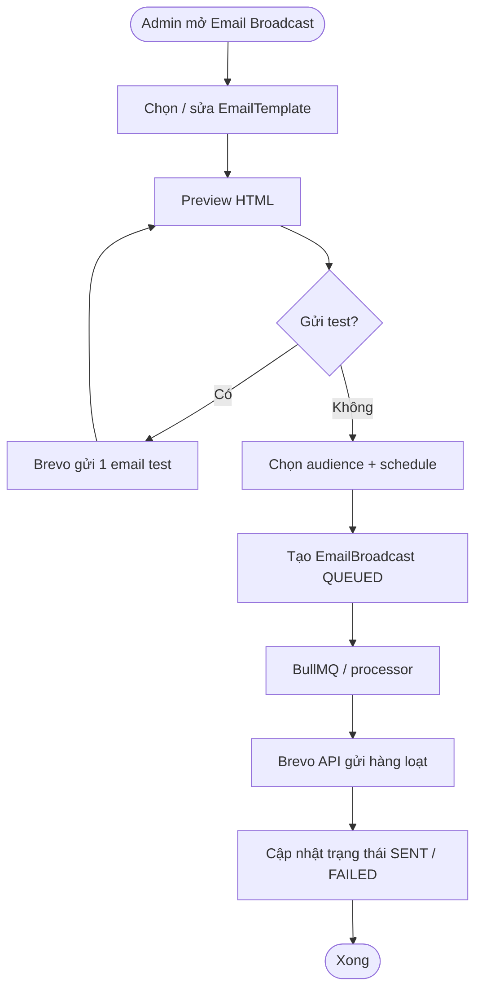

---

## C.3. Sơ đồ lớp (Class Diagram)

### C.3.1. Domain lớp nghiệp vụ (rút gọn — thiết kế logic)

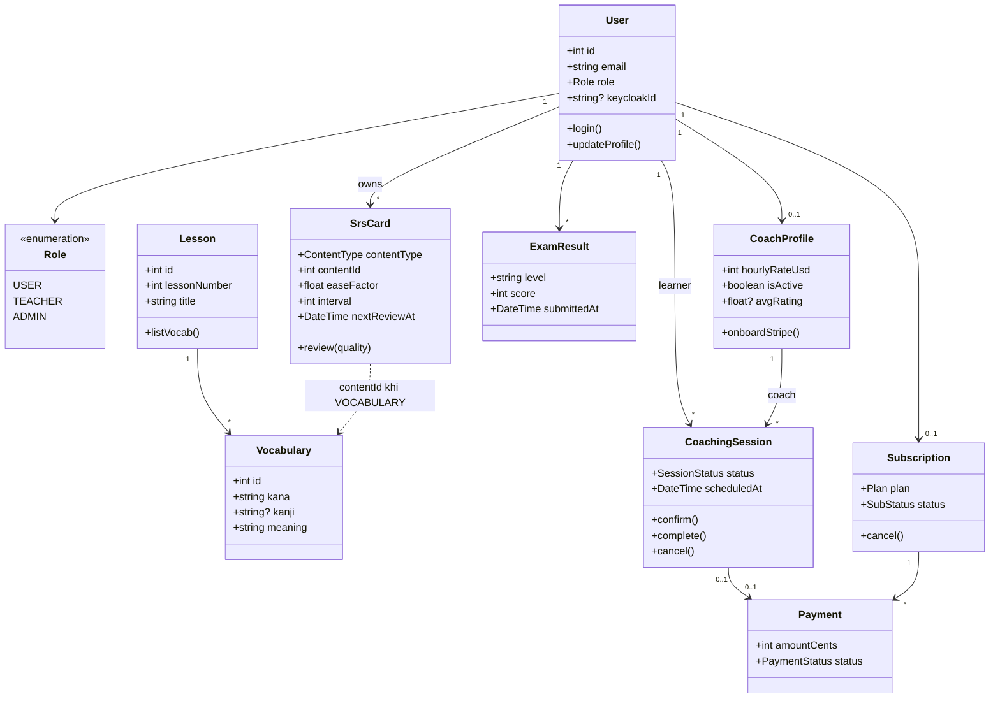

### C.3.2. Kiến trúc lớp ứng dụng (NestJS — layered)

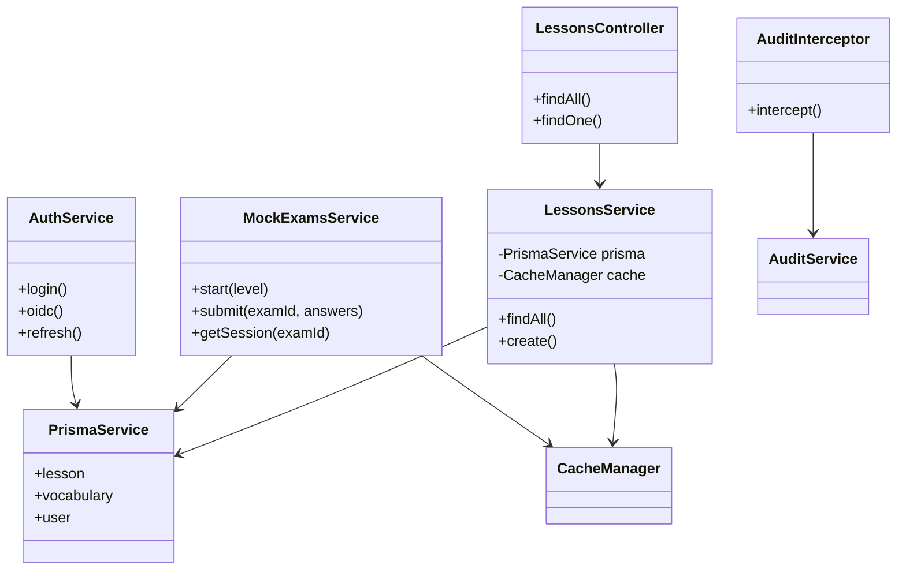

### C.3.3. Diễn giải Class Diagram

| Nhóm lớp | Vai trò |
|----------|---------|
| **Entity domain** | User, Lesson, SrsCard, Subscription… — ánh xạ Prisma models |
| **Application service** | `*Service` — nghiệp vụ, cache, gọi Stripe/gRPC |
| **Controller / Gateway** | HTTP REST hoặc gRPC entry |
| **Cross-cutting** | AuditInterceptor, JwtAuthGuard, Throttler |

---

## C.4. Sơ đồ trình tự (Sequence Diagram)

### C.4.1. Sequence — Đăng nhập Keycloak → JWT

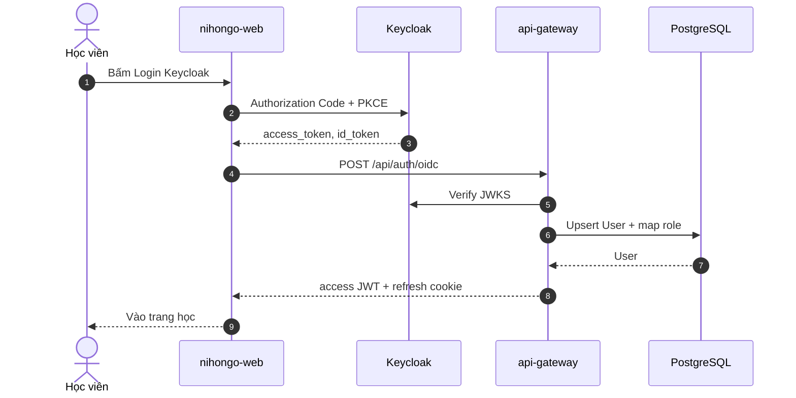

### C.4.2. Sequence — Xem từ vựng (cache Redis)

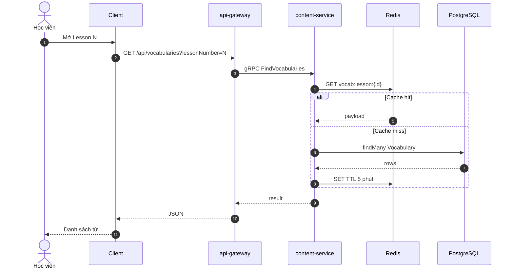

### C.4.3. Sequence — Thi thử JLPT

```mermaid
sequenceDiagram
  autonumber
  actor HV as Học viên
  participant App as Client
  participant GW as api-gateway
  participant ES as exam-service
  participant Redis as Redis
  participant DB as PostgreSQL
  participant Kafka as Kafka

  HV->>App: Start Mock N5
  App->>GW: POST /api/mock-exams/start
  GW->>ES: Start(level)
  ES->>DB: Lấy pool câu hỏi
  ES->>Redis: SET session TTL 3h
  ES-->>App: examId + questions

  HV->>App: Nộp bài
  App->>GW: POST /api/mock-exams/submit
  GW->>ES: Submit(answers)
  ES->>Redis: GET session
  ES->>ES: Chấm điểm
  ES->>DB: Lưu ExamResult (nếu login)
  ES->>Redis: DEL session
  ES->>Kafka: edu.exam.submitted
  ES-->>App: score + review
```

### C.4.4. Sequence — Mua subscription

```mermaid
sequenceDiagram
  autonumber
  actor HV as Học viên
  participant Web as Web
  participant GW as Gateway
  participant Pay as payment-service
  participant Stripe as Stripe
  participant DB as PostgreSQL

  HV->>Web: Chọn gói PRO
  Web->>GW: POST /api/subscriptions/checkout
  GW->>Pay: createCheckout()
  Pay->>Stripe: Checkout Session
  Stripe-->>Web: URL thanh toán
  HV->>Stripe: Thanh toán thẻ
  Stripe->>GW: webhook invoice.paid
  GW->>Pay: handleWebhook idempotent
  Pay->>DB: Upsert Subscription ACTIVE
  Pay-->>Stripe: 200
```

---

## C.5. Sơ đồ trạng thái (State Machine Diagram)

### C.5.1. State — Subscription

```mermaid
stateDiagram-v2
  [*] --> TRIALING: Tạo sub có trial
  [*] --> ACTIVE: Thanh toán thành công ngay

  TRIALING --> ACTIVE: Hết trial + charge OK
  ACTIVE --> PAST_DUE: Thanh toán thất bại
  PAST_DUE --> ACTIVE: Retry thành công
  PAST_DUE --> CANCELED: Hết retry / hủy
  ACTIVE --> CANCELED: User hủy / admin
  ACTIVE --> PAUSED: Tạm dừng (nếu bật)
  PAUSED --> ACTIVE: Resume

  CANCELED --> [*]
```

### C.5.2. State — CoachingSession

```mermaid
stateDiagram-v2
  [*] --> PENDING: Học viên đặt lịch

  PENDING --> CONFIRMED: Thanh toán / coach xác nhận
  PENDING --> CANCELED: Hủy trước khi confirm

  CONFIRMED --> IN_PROGRESS: Đến giờ học
  CONFIRMED --> CANCELED: Hủy có điều kiện
  CONFIRMED --> NO_SHOW: Không tham dự

  IN_PROGRESS --> COMPLETED: Kết thúc buổi học
  IN_PROGRESS --> NO_SHOW: Một bên vắng

  COMPLETED --> [*]
  CANCELED --> [*]
  NO_SHOW --> [*]
```

### C.5.3. State — SrsCard (vòng đời ôn tập)

```mermaid
stateDiagram-v2
  [*] --> New: Thêm từ bài học vào hàng đợi

  New --> Learning: review lần 1 (interval=1)
  Learning --> Learning: quality thấp → reset interval
  Learning --> Reviewing: repetitions≥1, interval tăng
  Reviewing --> Reviewing: ôn định kỳ theo nextReviewAt
  Reviewing --> Mastered: interval ≥ 21 ngày
  Mastered --> Reviewing: quên (quality thấp) — tùy chính sách

  note right of Mastered
    mastered = true
    vẫn có thể due theo lịch dài
  end note
```

### C.5.4. State — MockExamSession (Redis)

```mermaid
stateDiagram-v2
  [*] --> Created: start() lưu Redis TTL 3h
  Created --> InProgress: học viên làm bài
  InProgress --> Submitted: submit() chấm điểm
  InProgress --> Expired: hết TTL / mất session
  Submitted --> [*]
  Expired --> [*]
```

### C.5.5. State — Payment

```mermaid
stateDiagram-v2
  [*] --> REQUIRES_PAYMENT: Tạo intent
  REQUIRES_PAYMENT --> SUCCEEDED: Stripe confirm
  REQUIRES_PAYMENT --> FAILED: Thẻ lỗi / hủy
  SUCCEEDED --> REFUNDED: Admin refund
  FAILED --> [*]
  REFUNDED --> [*]
  SUCCEEDED --> [*]
```

---

# PHẦN D — ĐỐI CHIẾU HAI HƯỚNG & KẾT LUẬN

## D.1. Bảng đối chiếu

| Tiêu chí | Hướng cấu trúc | Hướng đối tượng |
|----------|----------------|-----------------|
| **Trọng tâm** | Chức năng + luồng dữ liệu + kho DL | Đối tượng, thông điệp, trạng thái |
| **Sơ đồ chính** | BFD, DFD, ERD | Use Case, Activity, Class, Sequence, State |
| **Phù hợp** | Phân tích yêu cầu, thiết kế CSDL | Thiết kế code NestJS/Prisma, runtime |
| **Ánh xạ sang code** | Tiến trình DFD ≈ service/use-case | Class ≈ model + service; State ≈ enum status |
| **Điểm mạnh trong EDU APP** | Làm rõ D1–D6 và luồng Stripe/SRS | Làm rõ lifecycle Subscription/Session/SRS |

## D.2. Ánh xạ thực tế sang hiện trạng

| Phân tích | Hiện trạng triển khai |
|-----------|----------------------|
| BFD 2–4 | `content-service`, `exam-service` |
| BFD 5 | `payment-service` + Stripe |
| BFD 1, 6, 7 | `api-gateway` (+ Brevo, LiveKit, audit Mongo) |
| DFD cache | Redis (`CacheKeys`, mock session) |
| ERD | Prisma `packages/prisma-nihongo` |
| Class / Sequence | NestJS modules, gRPC controllers |
| State | Enum Prisma: `Subscription.status`, `CoachingSession.status`… |

## D.3. Kết luận

1. **Hướng cấu trúc** giúp làm rõ *hệ thống làm gì* và *dữ liệu đi đâu* — nền tảng cho thiết kế DB và phân quyền chức năng.
2. **Hướng đối tượng** giúp làm rõ *ai tương tác với ai theo thời gian* và *đối tượng đổi trạng thái thế nào* — nền tảng cho thiết kế API và code.
3. Hai hướng **bổ sung**, không loại trừ: ERD (cấu trúc) ↔ Class Diagram (OO); DFD process ↔ Sequence/Activity.
4. Hệ thống EDU APP đã triển khai đủ các phân hệ trong BFD; các state machine trong báo cáo khớp với enum/webhook thực tế trong codebase.

## D.4. Tài liệu tham chiếu

| File | Nội dung |
|------|----------|
| [analysis-design.md](./analysis-design.md) | Use case & context diagram |
| [system-design.md](./system-design.md) | Kiến trúc kỹ thuật |
| [db-design.md](./db-design.md) | Chi tiết ER / bảng |
| [accounts.md](./accounts.md) | Tài khoản demo theo role |
| [mongodb.md](./mongodb.md) | Audit (ngoài ER quan hệ) |
| [nginx.md](./nginx.md) | Cổng vào hệ thống |
| [interview-questions.md](./interview-questions.md) | Bộ Q&A senior sâu (Postgres, Nest, Kafka, Stripe…) |

---

# PHẦN E — CÂU HỎI PHỎNG VẤN

Phần này phục vụ **bảo vệ đồ án / phỏng vấn** dựa trên báo cáo phân tích–thiết kế và code EDU APP. Mỗi câu có **gợi ý trả lời ngắn**; chi tiết kỹ thuật sâu xem [interview-questions.md](./interview-questions.md).

---

## E.1. Phân tích hướng cấu trúc (BFD · DFD · ERD)

**E1. BFD và Use Case khác nhau thế nào? Khi nào dùng cái nào?**

> **BFD** phân rã *chức năng hệ thống* theo cây (0 → 1.x → 1.1…), nhìn từ trong ra — “hệ thống làm những việc gì”. **Use Case** nhìn từ *tác nhân* — “ai đạt mục tiêu gì”. Trong EDU APP: BFD mục 3.2 = Ôn SRS; Use Case UC03 cũng là ôn SRS nhưng gắn USER + tiền/hậu điều kiện. Làm báo cáo nên có **cả hai**: BFD cho cấu trúc chức năng, UC cho tương tác người–máy.

**E2. DFD mức 0 và mức 1 khác nhau ra sao? Cho ví dụ từ EDU APP.**

> **Mức 0 (context)**: một bong bóng “EDU APP” + tác nhân ngoài (USER, Stripe, Keycloak…) — không lộ kho dữ liệu nội bộ. **Mức 1**: phân rã thành tiến trình 1.0–7.0 và kho D1–D6 (User, Nội dung, Progress, Payment…). Ví dụ: mức 0 chỉ nói USER ↔ hệ thống “học & thanh toán”; mức 1 mới thấy luồng USER → 3.0 SRS → D3 SrsCard và USER → 5.0 → Stripe.

**E3. Thế nào là cân bằng DFD? Lỗi thường gặp khi vẽ DFD?**

> **Cân bằng**: dữ liệu vào/ra của tiến trình cha (mức n) phải khớp tổng vào/ra các tiến trình con (mức n+1). Lỗi thường: quên kho dữ liệu; vẽ luồng điều khiển (if/else) thay vì luồng dữ liệu; đặt logic xử lý vào kho DL; mức 0 lộ quá nhiều tiến trình.

**E4. Vì sao EDU APP tách PostgreSQL (nghiệp vụ) và MongoDB (audit)? Liên hệ ERD.**

> ERD quan hệ mô tả **thực thể bền vững + ràng buộc** (User–SrsCard–Subscription). Audit log ghi nhiều, schema `metadata` linh hoạt, TTL 90 ngày → phù hợp **document** Mongo, không cần vào ERD quan hệ. Ghi fire-and-forget nên không block API — đúng “non-critical side effect”.

**E5. Trong ERD, vì sao `SrsCard` dùng `(contentType, contentId)` thay vì FK cứng tới Vocabulary?**

> Một thẻ SRS có thể trỏ Vocab / Grammar / Kanji (đa hình). FK cứng buộc 3 bảng quan hệ hoặc 3 bảng SRS. Pattern polymorphic giúp một bảng `SrsCard` + unique `(userId, contentType, contentId)`. Trade-off: DB không enforce FK — app layer/`exam-service` phải đảm bảo `contentId` tồn tại.

**E6. Ràng buộc 1–1 User–Subscription trên ERD phản ánh gì trong code?**

> `@unique` trên `Subscription.userId` (Prisma). Nghiệp vụ: mỗi học viên một gói hiện hành; lịch sử thanh toán nằm ở `Payment`, không nhân bản Subscription. Khi Stripe webhook cập nhật, upsert theo `userId` / `stripeSubscriptionId`.

**E7. Redis có phải thực thể trên ERD không? Vì sao?**

> **Không.** Redis là **cache/session tạm** (vocab list TTL 5′, mock exam session TTL 3h). Mất Redis không mất dữ liệu gốc — chỉ miss cache / mất bài thi đang làm. ERD chỉ mô hình hóa dữ liệu bền vững trên PostgreSQL (+ ghi chú Mongo audit riêng).

---

## E.2. Phân tích hướng đối tượng (UC · UML)

**E8. Quan hệ «include» và «extend» trên Use Case? Ví dụ trong hệ thống.**

> **include**: luôn xảy ra (UC “Đăng nhập Google” include Google OAuth). **extend**: tùy điều kiện (có thể extend “Gửi email chào mừng” sau đăng ký nếu Brevo bật). Trong báo cáo: UC07 mua subscription **include** Stripe; UC06 dịch **include** MyMemory.

**E9. Activity Diagram và Sequence Diagram dùng khi nào?**

> **Activity**: quy trình / quyết định (nhánh if) — ví dụ SRS: còn thẻ? → ôn tiếp. **Sequence**: tương tác *theo thời gian* giữa đối tượng/component — ví dụ Client → Gateway → content-service → Redis → DB. Bảo vệ đồ án: lấy **một UC** vẽ cả Activity (nghiệp vụ) lẫn Sequence (kỹ thuật).

**E10. Class Diagram domain khác Class Diagram layered (Controller–Service) thế nào?**

> **Domain**: User, SrsCard, Subscription — khái niệm nghiệp vụ, gần ERD. **Layered**: LessonsController → LessonsService → PrismaService — cấu trúc code NestJS. Phỏng vấn hay hỏi: “Controller có được chứa business logic không?” → Không; logic nằm Service.

**E11. Giải thích State Machine `CoachingSession`. Sự kiện nào chuyển trạng thái?**

> `PENDING` → `CONFIRMED` (thanh toán/webhook OK) → `IN_PROGRESS` (đến giờ) → `COMPLETED`. Nhánh: `PENDING`/`CONFIRMED` → `CANCELED`; hoặc `NO_SHOW`. Không cho nhảy tùy tiện (ví dụ COMPLETED → PENDING) — validate trong `payment-service` / marketplace API.

**E12. State của Subscription liên quan webhook Stripe ra sao?**

> Stripe là nguồn sự kiện: `invoice.paid` → ACTIVE; payment fail → PAST_DUE; cancel → CANCELED. Handler phải **idempotent** (`WebhookEvent`) vì Stripe có thể gửi lại cùng event.

**E13. Vì sao mock exam session lưu Redis (State Created→Submitted) thay vì PostgreSQL?**

> Session tạm, TTL 3h, chứa đáp án server-side, không cần báo cáo dài hạn. Submit xong mới ghi `ExamResult` vào Postgres (nếu đã login). Giảm tải DB và tránh lưu đáp án lộ trên client.

---

## E.3. Kiến trúc & triển khai (gắn code EDU APP)

**E14. Vì sao tách `content-service` / `exam-service` (gRPC) thay vì tất cả trong api-gateway?**

> Tách bounded context: nội dung học vs thi/progress. Scale độc lập, deploy riêng, contract rõ qua protobuf. Gateway là BFF HTTP: auth, payment, chat, proxy gRPC. Trade-off: độ trễ mạng nội bộ + vận hành nhiều process.

**E15. Nginx trong hệ thống đóng vai trò gì?**

> Reverse proxy cổng `:8080`: route theo Host/path tới web, `/api` → gateway, `auth.localhost` → Keycloak; hỗ trợ emulator `10.0.2.2`. Không chứa business logic. Xem [nginx.md](./nginx.md).

**E16. Cache vocab/lesson: key, TTL, khi nào invalidate?**

> Key: `lessons:all`, `vocab:lesson:{id}`, `grammar:lesson:{id}`; TTL ~5 phút (`CacheTTL.medium`). Create/update/delete vocab/grammar/lesson → `cacheManager.del(...)`. Đọc nhiều, ghi ít → cache hợp lý.

**E17. AuditInterceptor ghi Mongo thế nào để không làm chậm response?**

> Log bất đồng bộ, nuốt lỗi (fire-and-forget). Request vẫn trả về nếu Mongo down — chỉ mất audit. Xem [mongodb.md](./mongodb.md).

**E18. Luồng Keycloak → JWT local khác login email/password thế nào?**

> OIDC: browser lấy token Keycloak → `POST /api/auth/oidc` → gateway verify JWKS, upsert User + map role → cấp **JWT local** + refresh cookie. Email/password: verify bcrypt trong DB, cùng kiểu JWT local. Client sau đó chỉ gửi Bearer JWT local, không gọi Keycloak mỗi request API.

**E19. Phòng double-booking coaching session thế nào?**

> Conflict check theo `coachId + scheduledAt` (status ≠ CANCELED). Production nên `SELECT FOR UPDATE` / unique partial index để tránh race. Chi tiết: [interview-questions.md](./interview-questions.md) Q2.

**E20. Guest làm mock exam được không? Dữ liệu lưu đâu?**

> Được (public start/submit). Session trên Redis; **không** gắn `ExamResult.userId` nếu chưa login. Đăng nhập sau không tự gắn lại bài guest trừ khi thiết kế thêm merge.

---

## E.4. Câu hỏi nhanh (one-liner — kiểm tra nắm bắt)

| # | Câu hỏi | Gợi ý 1 câu |
|---|---------|-------------|
| E21 | Actor nào host livestream? | TEACHER (ADMIN cũng có thể tùy policy) |
| E22 | Kafka topic ví dụ trong app? | `edu.exam.submitted`, `edu.payment.succeeded`, `edu.vocab.reviewed` |
| E23 | SM-2 `mastered` khi nào? | `interval >= 21` ngày |
| E24 | English và Nihongo chung DB không? | Không — `postgres-nihongo` vs `postgres-english` |
| E25 | Rate limit login dùng gì? | Redis sliding window / Throttler trên auth |
| E26 | File upload lưu trực tiếp DB? | Không — S3 presigned URL |
| E27 | DFD kho D3 là gì? | Progress: SrsCard, ExamResult, streak… |
| E28 | Class `Payment` gắn entity nào? | Subscription **hoặc** CoachingSession |
| E29 | Mobile Android gọi API qua đâu thường? | `10.0.2.2:8080` (nginx) hoặc `:3000` gateway |
| E30 | Hai hướng phân tích bổ sung thế nào? | ERD↔Class; DFD↔Sequence/Activity; BFD↔Use Case |

---

## E.5. Câu hỏi mở (hành vi / thiết kế — không có đáp án duy nhất)

**E31.** Nếu 10.000 user ôn SRS cùng lúc lúc 20:00, bottleneck ở đâu? Bạn scale thế nào (cache, read replica, queue)?

**E32.** So sánh polling chat hiện tại với WebSocket/Socket.io — trade-off vận hành và UX.

**E33.** Nếu Brevo downtime, quên mật khẩu xử lý ra sao? (queue retry, thông báo user, không leak enumeration)

**E34.** Thiết kế lại polymorphic `SrsCard` bằng JOIN table riêng cho Vocab/Grammar/Kanji — ưu/nhược so với hiện tại.

**E35.** Bạn sẽ bổ sung sơ đồ nào nếu báo cáo phải thêm *bảo mật* (threat model, sequence login brute-force)?

---

## E.6. Gợi ý cách trả lời khi bảo vệ / phỏng vấn

1. **Nêu sơ đồ trước** (“Theo DFD mức 1…”) rồi mới nhảy vào code.
2. **Nêu trade-off** (cache vs consistency; gRPC vs monolith; Mongo audit vs Postgres).
3. **Chỉ đúng file/module** nếu hỏi sâu: `content-service` cache, `payment-service` webhook, `AuditInterceptor`.
4. Bộ Q&A kỹ thuật dài: [interview-questions.md](./interview-questions.md), [interview-backend-android-rn-swift.md](./interview-backend-android-rn-swift.md), [interview-mobile.md](./interview-mobile.md).

---

*Hết báo cáo.*
