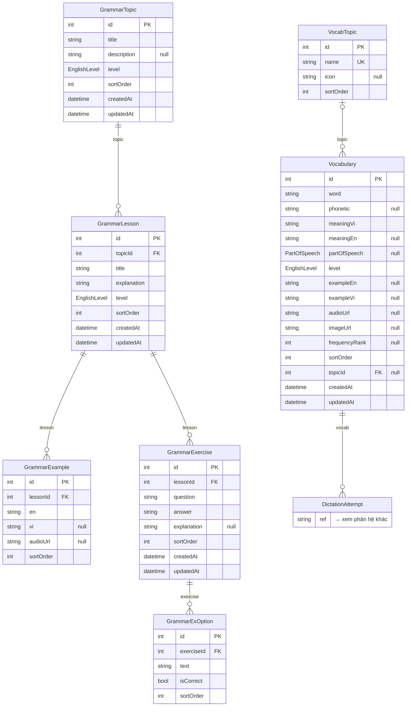
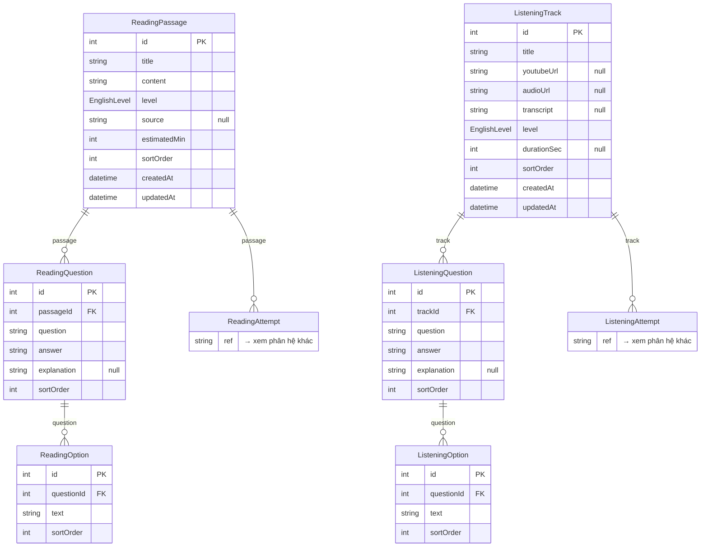
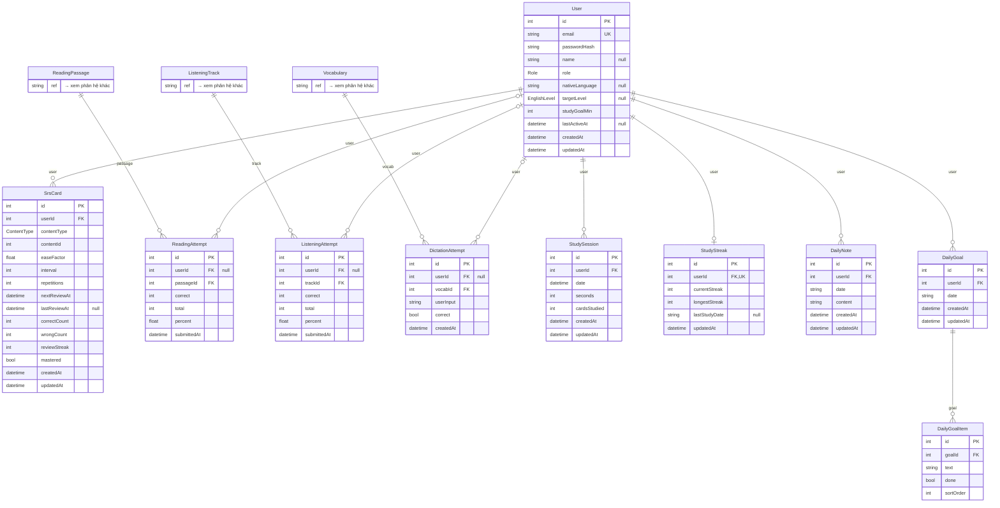

# Sơ đồ ER — DB english_learning

> **Tự sinh** từ `packages/prisma-english/schema.prisma` bởi `npm run db:erd`.
> Đừng sửa tay — sửa schema (hoặc cách chia phân hệ trong `packages/prisma-nihongo/scripts/gen-erd.ts`) rồi chạy lại.

**23 bảng · 4 enum · 21 quan hệ khóa ngoại.**
Ký hiệu: `PK` khóa chính · `FK` khóa ngoại · `UK` duy nhất · `"null"` cho phép null · `_list` mảng (Postgres array).
Bảng thu gọn (`→ xem phân hệ khác`) thuộc phân hệ khác, chỉ vẽ để thấy liên kết.

## Mục lục

- [Từ vựng & ngữ pháp](#từ-vựng--ngữ-pháp) — 7 bảng
- [Đọc & nghe](#đọc--nghe) — 6 bảng
- [Người dùng & tiến độ](#người-dùng--tiến-độ) — 10 bảng

## Từ vựng & ngữ pháp

Chủ đề từ vựng (CEFR A1–C2), bài ngữ pháp kèm ví dụ và bài tập. (7 bảng; liên kết ngoài: `DictationAttempt`)

## Đọc & nghe

Bài đọc, bài nghe và câu hỏi trắc nghiệm. (6 bảng; liên kết ngoài: `ListeningAttempt`, `ReadingAttempt`)

## Người dùng & tiến độ

Tài khoản, SRS, lượt làm bài (userId null = khách), phiên học, streak, nhật ký, mục tiêu ngày. (10 bảng; liên kết ngoài: `ListeningTrack`, `ReadingPassage`, `Vocabulary`)

## Enum

| Enum | Giá trị |
|------|---------|
| `Role` | `USER` · `ADMIN` |
| `EnglishLevel` | `A1` · `A2` · `B1` · `B2` · `C1` · `C2` |
| `PartOfSpeech` | `noun` · `verb` · `adjective` · `adverb` · `preposition` · `conjunction` · `pronoun` · `interjection` · `phrase` · `phrasal_verb` |
| `ContentType` | `VOCABULARY` · `GRAMMAR` |
