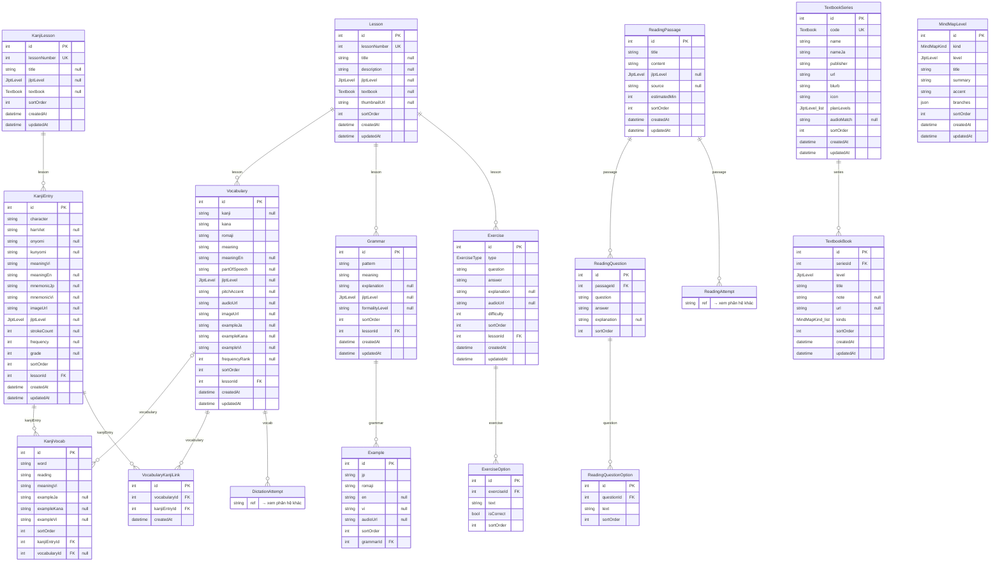
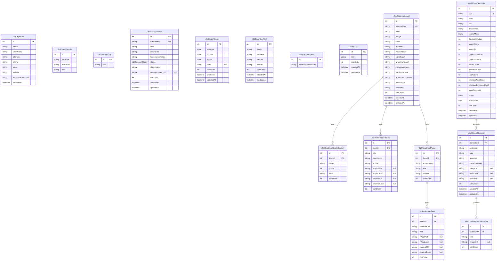
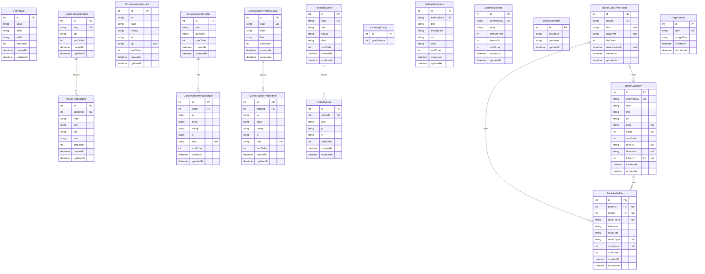
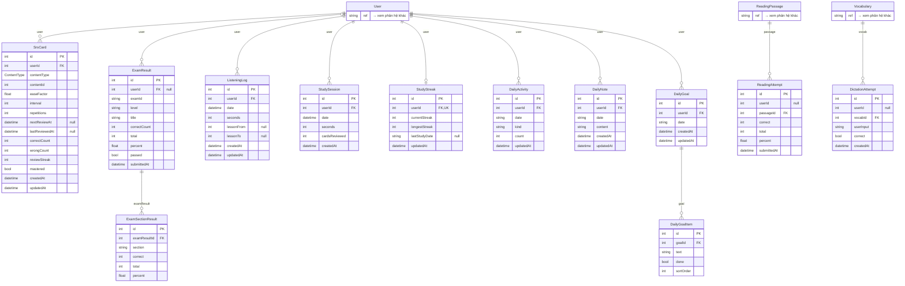
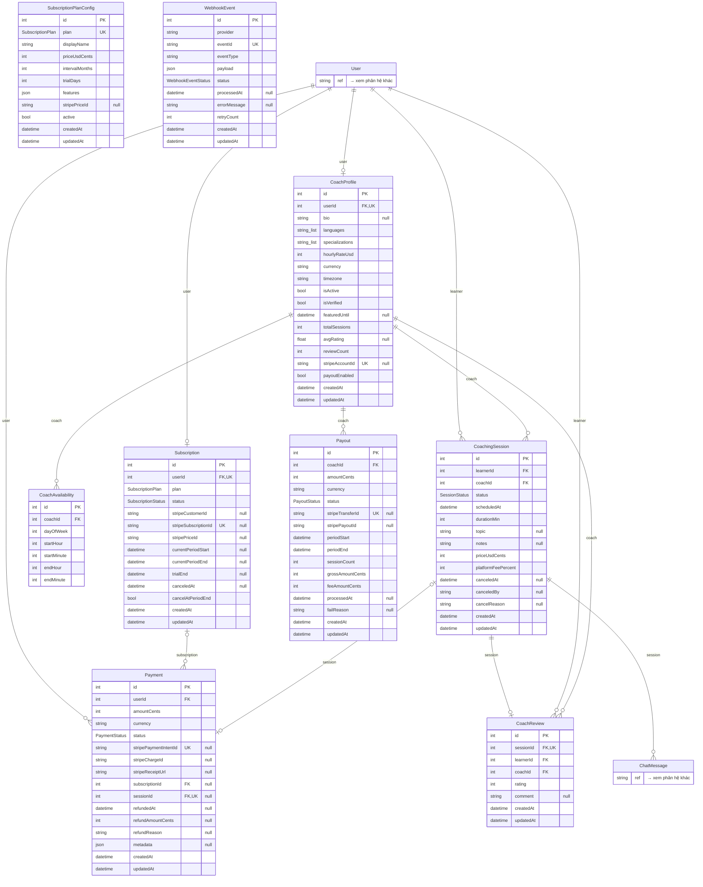
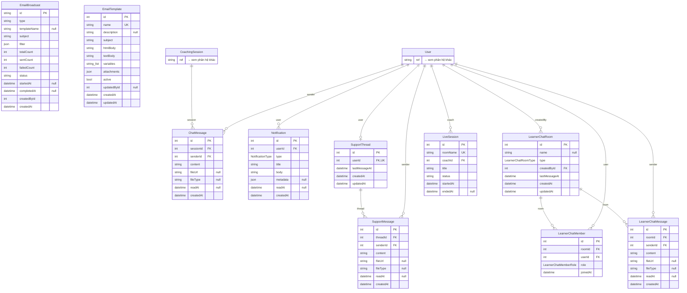

# Sơ đồ ER — DB nihongo

> **Tự sinh** từ `packages/prisma-nihongo/schema.prisma` bởi `npm run erd -w @edu/prisma-nihongo`.
> Đừng sửa tay — sửa schema (hoặc cách chia phân hệ trong `scripts/gen-erd.ts`) rồi chạy lại.

**107 bảng · 17 enum · 76 quan hệ khóa ngoại.**
Ký hiệu: `PK` khóa chính · `FK` khóa ngoại · `UK` duy nhất · `"null"` cho phép null · `_list` mảng (Postgres array).
Bảng thu gọn (`→ xem phân hệ khác`) thuộc phân hệ khác, chỉ vẽ để thấy liên kết.

## Mục lục

- [Nội dung học](#nội-dung-học) — 16 bảng
- [JLPT: lịch thi, lộ trình, thi thử](#jlpt-lịch-thi-lộ-trình-thi-thử) — 16 bảng
- [Tham chiếu ngôn ngữ](#tham-chiếu-ngôn-ngữ) — 20 bảng
- [Trang & nội dung tĩnh](#trang--nội-dung-tĩnh) — 18 bảng
- [Người dùng & xác thực](#người-dùng--xác-thực) — 6 bảng
- [Tiến độ học](#tiến-độ-học) — 12 bảng
- [Thanh toán & marketplace coach](#thanh-toán--marketplace-coach) — 9 bảng
- [Giao tiếp & thông báo](#giao-tiếp--thông-báo) — 10 bảng

## Nội dung học

Bài học (Minna, JLPT, giáo trình Sou Matome/Shinkanzen/TRY — `Lesson.textbook`), kanji, đọc hiểu, mind map, danh mục giáo trình. (16 bảng; liên kết ngoài: `DictationAttempt`, `ReadingAttempt`)

- **VocabularyKanjiLink** — Liên kết từ vựng ↔ kanji (từ chứa chữ kanji nào). Bảng có sẵn trong DB (~2.5k dòng), trước đây tạo bằng db push nên nằm ngoài schema — giữ lại, không xóa.
- **TextbookSeries** — Danh mục bộ giáo trình tham khảo (menu "Giáo trình", trang /textbooks, khung sách ở mind map).
- **TextbookBook** — Một cuốn sách của bộ giáo trình theo cấp + kỹ năng.

## JLPT: lịch thi, lộ trình, thi thử

Lịch thi Đà Nẵng, lộ trình N5–N1, đề thi thử tùy chỉnh. (16 bảng)

- **MockExamTemplate** — Cấu hình đề thi thử JLPT — admin quản lý qua /mock-exam.

## Tham chiếu ngôn ngữ

Bảng kana, đếm số, tên quốc gia, hậu tố, quy tắc phát âm, tiếng Anh ↔ katakana. (20 bảng)

```mermaid
erDiagram
  KanaSection {
    int id PK
    KanaScript script
    string slug
    string title
    string subtitle "null"
    int columns
    int sortOrder
    datetime createdAt
    datetime updatedAt
  }
  KanaCell {
    int id PK
    int sectionId FK
    int rowIndex
    int colIndex
    string kana
    string romaji
  }
  KanaRomaji {
    int id PK
    string kana UK
    string romaji
    int sortOrder
    datetime createdAt
    datetime updatedAt
  }
  CounterCategory {
    int id PK
    string slug UK
    string label
    string hint
    int sortOrder
    datetime createdAt
    datetime updatedAt
  }
  CounterItem {
    int id PK
    int categoryId FK
    string displayNumber
    string kanji "null"
    string kana
    string romaji
    string meaningVi
    int sortOrder
  }
  CountryRegion {
    int id PK
    string slug UK
    string label
    int sortOrder
    datetime createdAt
    datetime updatedAt
  }
  CountryNameItem {
    int id PK
    int regionId FK
    string nameJa
    string kana
    string romaji
    string meaningVi
    string countryCode
    int sortOrder
  }
  VocabSuffixGroup {
    int id PK
    string slug UK
    string label
    string labelJa
    string hint
    int sortOrder
    datetime createdAt
    datetime updatedAt
  }
  VocabSuffixItem {
    int id PK
    int groupId FK
    string suffix
    string_list forms
    string kana
    string romaji
    string meaningVi
    string attachesTo
    string_list pos
    string exampleJa
    string exampleVi
    int sortOrder
    datetime createdAt
    datetime updatedAt
  }
  PronunciationRulesMeta {
    int id PK
    string intro
    datetime createdAt
    datetime updatedAt
  }
  PronunciationRuleTip {
    int id PK
    string text
    int sortOrder
    datetime createdAt
    datetime updatedAt
  }
  PronunciationRuleSection {
    int id PK
    string slug UK
    string title
    string summary
    int sortOrder
    datetime createdAt
    datetime updatedAt
  }
  PronunciationRulePoint {
    int id PK
    int sectionId FK
    string label "null"
    string japanese "null"
    string romaji "null"
    string explanation
    int sortOrder
  }
  PronunciationRuleExample {
    int id PK
    int sectionId FK
    string japanese
    string romaji
    string meaning
    string note "null"
    int sortOrder
  }
  EnglishKatakanaMeta {
    int id PK
    string intro
    datetime createdAt
    datetime updatedAt
  }
  EnglishKatakanaTip {
    int id PK
    string text
    int sortOrder
    datetime createdAt
    datetime updatedAt
  }
  EnglishKatakanaSection {
    int id PK
    string slug UK
    string title
    string summary
    int sortOrder
    datetime createdAt
    datetime updatedAt
  }
  EnglishKatakanaPoint {
    int id PK
    int sectionId FK
    string explanation
    string english "null"
    string katakana "null"
    string romaji "null"
    int sortOrder
  }
  EnglishKatakanaMapping {
    int id PK
    int sectionId FK
    string english
    string katakana
    string romaji
    string note "null"
    int sortOrder
  }
  EnglishKatakanaExample {
    int id PK
    int sectionId FK
    string english
    string katakana
    string romaji
    string meaningVi
    string note "null"
    int sortOrder
  }
  KanaSection ||--}o KanaCell : section
  CounterCategory ||--}o CounterItem : category
  CountryRegion ||--}o CountryNameItem : region
  VocabSuffixGroup ||--}o VocabSuffixItem : group
  PronunciationRuleSection ||--}o PronunciationRulePoint : section
  PronunciationRuleSection ||--}o PronunciationRuleExample : section
  EnglishKatakanaSection ||--}o EnglishKatakanaPoint : section
  EnglishKatakanaSection ||--}o EnglishKatakanaMapping : section
  EnglishKatakanaSection ||--}o EnglishKatakanaExample : section
```

- **KanaRomaji** — Tra cứu kana → romaji (dùng cho dịch nhanh, TTS overlay)

## Trang & nội dung tĩnh

Trang chủ, giao tiếp/đóng vai, nghe mỗi ngày, file nghe sách, banner. (18 bảng)

- **BookAudioMeta** — File nghe / link sách (Mailee Books & tương tự)

## Người dùng & xác thực

Tài khoản, token, tùy chọn email, thiết bị push. (6 bảng; liên kết ngoài: `ChatMessage`, `CoachProfile`, `CoachReview`, `CoachingSession`, `DailyActivity`, `DailyGoal`, `DailyNote`, `ExamResult`, `LearnerChatMember`, `LearnerChatMessage`, `LearnerChatRoom`, `ListeningLog`, `LiveSession`, `Notification`, `Payment`, `SrsCard`, `StudySession`, `StudyStreak`, `Subscription`, `SupportMessage`, `SupportThread`)

```mermaid
erDiagram
  User {
    int id PK
    string email UK
    string passwordHash "null"
    string googleId UK "null"
    string keycloakId UK "null"
    Role role
    string name "null"
    string avatarUrl "null"
    string nativeLanguage "null"
    JlptLevel targetJlptLevel "null"
    int studyGoalMinutes "null"
    datetime lastActiveAt "null"
    datetime createdAt
    datetime updatedAt
    datetime emailVerifiedAt "null"
    bool emailBounced
  }
  RefreshToken {
    string id PK
    string token UK
    int userId FK
    datetime expiresAt
    bool revoked
    datetime createdAt
  }
  PasswordResetToken {
    string id PK
    string tokenHash UK
    int userId FK
    datetime expiresAt
    datetime usedAt "null"
    datetime createdAt
  }
  EmailVerificationToken {
    string id PK
    string tokenHash UK
    int userId FK
    datetime expiresAt
    datetime usedAt "null"
    datetime createdAt
  }
  EmailPrefs {
    int id PK
    int userId FK, UK
    bool receiveProgress
    bool receiveStreak
    int lastMilestoneNotified
    datetime updatedAt
  }
  PushDeviceToken {
    string id PK
    int userId FK
    string token UK
    string platform
    datetime createdAt
    datetime updatedAt
  }
  ChatMessage {
    string ref "→ xem phân hệ khác"
  }
  CoachProfile {
    string ref "→ xem phân hệ khác"
  }
  CoachReview {
    string ref "→ xem phân hệ khác"
  }
  CoachingSession {
    string ref "→ xem phân hệ khác"
  }
  DailyActivity {
    string ref "→ xem phân hệ khác"
  }
  DailyGoal {
    string ref "→ xem phân hệ khác"
  }
  DailyNote {
    string ref "→ xem phân hệ khác"
  }
  ExamResult {
    string ref "→ xem phân hệ khác"
  }
  LearnerChatMember {
    string ref "→ xem phân hệ khác"
  }
  LearnerChatMessage {
    string ref "→ xem phân hệ khác"
  }
  LearnerChatRoom {
    string ref "→ xem phân hệ khác"
  }
  ListeningLog {
    string ref "→ xem phân hệ khác"
  }
  LiveSession {
    string ref "→ xem phân hệ khác"
  }
  Notification {
    string ref "→ xem phân hệ khác"
  }
  Payment {
    string ref "→ xem phân hệ khác"
  }
  SrsCard {
    string ref "→ xem phân hệ khác"
  }
  StudySession {
    string ref "→ xem phân hệ khác"
  }
  StudyStreak {
    string ref "→ xem phân hệ khác"
  }
  Subscription {
    string ref "→ xem phân hệ khác"
  }
  SupportMessage {
    string ref "→ xem phân hệ khác"
  }
  SupportThread {
    string ref "→ xem phân hệ khác"
  }
  User ||--}o LiveSession : coach
  User ||--}o RefreshToken : user
  User ||--}o PasswordResetToken : user
  User ||--}o SrsCard : user
  User o|--}o ExamResult : user
  User ||--}o ListeningLog : user
  User ||--}o StudySession : user
  User ||--|o StudyStreak : user
  User ||--}o DailyActivity : user
  User ||--}o DailyNote : user
  User ||--}o DailyGoal : user
  User ||--|o Subscription : user
  User ||--|o CoachProfile : user
  User ||--}o CoachingSession : learner
  User ||--}o Payment : user
  User ||--}o CoachReview : learner
  User ||--}o ChatMessage : sender
  User ||--}o Notification : user
  User ||--|o SupportThread : user
  User ||--}o SupportMessage : sender
  User ||--}o LearnerChatRoom : createdBy
  User ||--}o LearnerChatMember : user
  User ||--}o LearnerChatMessage : sender
  User ||--}o EmailVerificationToken : user
  User ||--|o EmailPrefs : user
  User ||--}o PushDeviceToken : user
```

## Tiến độ học

SRS, kết quả thi, nghe, phiên học, streak, nhật ký, mục tiêu ngày. (12 bảng; liên kết ngoài: `ReadingPassage`, `User`, `Vocabulary`)

## Thanh toán & marketplace coach

Gói thuê bao Stripe, coach, đặt lịch, thanh toán, chi trả, webhook. (9 bảng; liên kết ngoài: `ChatMessage`, `User`)

## Giao tiếp & thông báo

Chat coaching, thông báo, hỗ trợ, phòng chat cộng đồng, buổi live, email. (10 bảng; liên kết ngoài: `CoachingSession`, `User`)

## Enum

| Enum | Giá trị |
|------|---------|
| `Role` | `USER` · `TEACHER` · `ADMIN` |
| `JlptLevel` | `N5` · `N4` · `N3` · `N2` · `N1` |
| `ExerciseType` | `MULTIPLE_CHOICE` · `FILL_IN_BLANK` · `LISTENING` |
| `ContentType` | `VOCABULARY` · `GRAMMAR` · `KANJI` |
| `KanaScript` | `HIRAGANA` · `KATAKANA` |
| `JlptSessionStatus` | `REGISTRATION_OPEN` · `REGISTRATION_CLOSED` · `UPCOMING` · `PAST` |
| `Textbook` | `MINNA` · `KLL` · `SOUMATOME` · `SHINKANZEN` · `TRY` |
| `SubscriptionStatus` | `ACTIVE` · `PAST_DUE` · `CANCELED` · `TRIALING` · `PAUSED` |
| `SubscriptionPlan` | `FREE` · `BASIC` · `PRO` · `PRO_ANNUAL` |
| `PaymentStatus` | `PENDING` · `SUCCEEDED` · `FAILED` · `REFUNDED` · `PARTIALLY_REFUNDED` |
| `SessionStatus` | `PENDING` · `CONFIRMED` · `IN_PROGRESS` · `COMPLETED` · `CANCELED` · `NO_SHOW` |
| `PayoutStatus` | `PENDING` · `PROCESSING` · `PAID` · `FAILED` |
| `WebhookEventStatus` | `RECEIVED` · `PROCESSED` · `FAILED` · `IGNORED` |
| `NotificationType` | `PAYMENT_SUCCESS` · `PAYMENT_FAILED` · `SESSION_CONFIRMED` · `SESSION_CANCELED` · `SESSION_REMINDER` · `COACH_MESSAGE` · `SUPPORT_MESSAGE` · `GROUP_MESSAGE` · `SYSTEM` |
| `LearnerChatRoomType` | `DIRECT` · `GROUP` |
| `LearnerChatMemberRole` | `MEMBER` · `ADMIN` |
| `MindMapKind` | `GRAMMAR` · `VOCAB` · `KANJI` |
