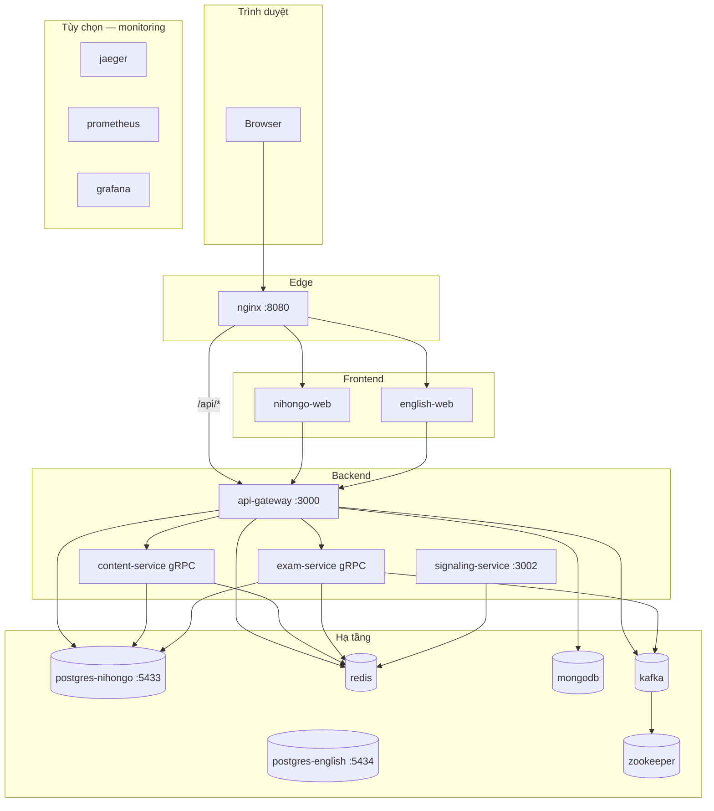

# Docker — chạy stack & chuyển sang máy khác

Hướng dẫn dùng `docker compose` cho monorepo `edu_app`: mỗi container làm gì, chạy từng phần, và deploy sang máy mới.

> Dev hàng ngày (nhẹ hơn Docker full app): xem [run-local.md](./run-local.md) — chỉ Docker infra + `npm run dev:*`.

---

## Yêu cầu máy đích


| Công cụ                                            | Ghi chú                                                       |
| -------------------------------------------------- | ------------------------------------------------------------- |
| **Docker Desktop** hoặc Docker Engine + Compose v2 | Windows / macOS / Linux                                       |
| **Git**                                            | Clone repo (cách khuyên dùng)                                 |
| **RAM**                                            | Tối thiểu ~4 GB cho stack Nihongo; full stack + Kafka ~6–8 GB |


---

## Checklist — chỉ học Nihongo (Docker full)

Một lệnh:

```powershell
npm run docker:up:nihongo
```

### Container **cần chạy** (10)


| #   | Service Compose    | Tên container          | Port host (nếu có) | Vì sao cần                                                                                                  |
| --- | ------------------ | ---------------------- | ------------------ | ----------------------------------------------------------------------------------------------------------- |
| 1   | `postgres-nihongo` | `edu-postgres-nihongo` | **5433**           | DB tiếng Nhật — từ vựng, user, thanh toán, chat…                                                            |
| 2   | `redis`            | `edu-redis`            | 6379               | Cache, session, rate-limit                                                                                  |
| 3   | `mongodb`          | `edu-mongodb`          | 27017              | Audit log, notification                                                                                     |
| 4   | `zookeeper`        | `edu-zookeeper`        | —                  | Kafka cần                                                                                                   |
| 5   | `kafka`            | `edu-kafka`            | 9092               | Event thi thử / async                                                                                       |
| 6   | `content-service`  | `edu-content`          | — (gRPC 50051)     | Nội dung JP qua gRPC                                                                                        |
| 7   | `exam-service`     | `edu-exam`             | — (gRPC 50052)     | Mock JLPT, quiz                                                                                             |
| 8   | `api-gateway`      | `edu-gateway`          | **3000**           | REST API, auth, Swagger (`ENGLISH_ENABLED=false` mặc định)                                                  |
| 9   | `nihongo-web`      | `edu-nihongo-web`      | — (qua nginx)      | Frontend Next.js                                                                                            |
| 10  | `nginx`            | `edu-nginx`            | **8080**           | Cổng vào app: [http://localhost:8080](http://localhost:8080)                                                |


Kiểm tra nhanh:

```powershell
docker ps --filter "name=edu-" --format "table {{.Names}}\t{{.Status}}"
```

### Container **không cần** khi chỉ học Nihongo


| Service             | Tên container          | Ghi chú                                                                 |
| ------------------- | ---------------------- | ----------------------------------------------------------------------- |
| `postgres-english`  | `edu-postgres-english` | Profile `english` — chỉ khi `ENGLISH_ENABLED=true` + stack tiếng Anh   |
| `english-web`       | `edu-english-web`      | Profile `english` — app tiếng Anh                                       |
| `signaling-service` | `edu-signaling`   | Chỉ video call                    |
| `jaeger`            | `edu-jaeger`      | Monitoring                        |
| `prometheus`        | `edu-prometheus`  | Monitoring                        |
| `grafana`           | `edu-grafana`     | Monitoring                        |


### Mở app

**[http://localhost:8080](http://localhost:8080)** — không cần `english.localhost`, không cần chạy SQL English.

### Tắt stack

```powershell
npm run docker:down
```

---

## Bản đồ container




---

## Từng container — làm gì?

### Hạ tầng dữ liệu & message


| Container            | Tên Docker             | Port host       | Vai trò                                                                                                          |
| -------------------- | ---------------------- | --------------- | ---------------------------------------------------------------------------------------------------------------- |
| **postgres-nihongo** | `edu-postgres-nihongo` | **5433** → 5432 | DB tiếng Nhật (`nihongo`). User `nihongo`. Volume `nihongo-app_postgres_data`.                                   |
| **postgres-english** | `edu-postgres-english` | **5434** → 5432 | DB tiếng Anh (`english_learning`). User `english`. Volume riêng `postgres_english_data`.                         |
| **redis**            | `edu-redis`            | 6379            | Cache, session, rate-limit, signaling presence.                                                                  |
| **mongodb**          | `edu-mongodb`          | 27017           | Audit log / một số tính năng gateway (chat, notification…). Gateway **phụ thuộc** container này khi chạy Docker. |
| **zookeeper**        | `edu-zookeeper`        | (nội bộ)        | Điều phối cho Kafka.                                                                                             |
| **kafka**            | `edu-kafka`            | 9092            | Event (nộp bài thi, async). **exam-service** và **api-gateway** cần Kafka.                                       |


### Backend (NestJS / gRPC)


| Container             | Tên Docker      | Port host           | Vai trò                                                                                        |
| --------------------- | --------------- | ------------------- | ---------------------------------------------------------------------------------------------- |
| **content-service**   | `edu-content`   | (gRPC 50051 nội bộ) | Từ vựng, ngữ pháp, nội dung đọc/nghe JP qua gRPC.                                              |
| **exam-service**      | `edu-exam`      | (gRPC 50052 nội bộ) | Mock JLPT, quiz, chấm bài thi.                                                                 |
| **api-gateway**       | `edu-gateway`   | **3000**            | REST API + Swagger `/api/docs`, auth JWT, proxy tới content/exam, English API, Stripe webhook… |
| **signaling-service** | `edu-signaling` | **3002**            | WebSocket WebRTC — **chỉ cần khi dùng video call**.                                            |


### Frontend (Next.js)


| Container       | Tên Docker        | Port host                     | Vai trò                                                                                                                                           |
| --------------- | ----------------- | ----------------------------- | ------------------------------------------------------------------------------------------------------------------------------------------------- |
| **nihongo-web** | `edu-nihongo-web` | (qua nginx)                   | App học tiếng Nhật. Gọi API qua rewrite → `api-gateway`.                                                                                          |
| **english-web** | `edu-english-web` | (qua nginx)                   | App học tiếng Anh. Profile `english` — khi tắt, nút 🇬🇧 trên Nihongo web cũng ẩn (probe runtime).                                                |
| **nginx**       | `edu-nginx`       | **8080** → 80 trong container | Reverse proxy: `/` → nihongo/english, `/api/`* → gateway. **Không bind cổng 80** host (tránh conflict). Đổi port: `NGINX_HTTP_PORT` trong `.env`. |


### Monitoring (có thể bỏ)


| Container      | Tên Docker       | Port host   | Vai trò                                           |
| -------------- | ---------------- | ----------- | ------------------------------------------------- |
| **jaeger**     | `edu-jaeger`     | 16686, 4318 | Trace OpenTelemetry (debug latency).              |
| **prometheus** | `edu-prometheus` | 9090        | Thu metrics.                                      |
| **grafana**    | `edu-grafana`    | **4000**    | Dashboard (user `admin` / pass `admin` mặc định). |


---

## URL sau khi chạy


| Mục                      | URL                                                                          |
| ------------------------ | ---------------------------------------------------------------------------- |
| Nihongo (qua nginx)      | [http://localhost:8080](http://localhost:8080)                               |
| English (qua nginx)      | [http://english.localhost:8080](http://english.localhost:8080) *(cần hosts)* |
| API / Swagger            | [http://localhost:3000/api/docs](http://localhost:3000/api/docs)             |
| API qua nginx            | [http://localhost:8080/api/](http://localhost:8080/api/)...                  |
| Signaling                | [http://localhost:3002](http://localhost:3002)                               |
| Grafana                  | [http://localhost:4000](http://localhost:4000)                               |
| Postgres Nihongo từ host | `localhost:5433`, user `nihongo`, DB `nihongo`                               |
| Postgres English từ host | `localhost:5434`, user `english`, DB `english_learning`                      |


**hosts file** (tùy chọn, cho `*.localhost`):

```
127.0.0.1 nihongo.localhost english.localhost
```

---

## Chạy service nào?

Compose **không bật profile** — anh liệt kê tên service cần chạy. Các service phụ thuộc phải có trong lệnh (hoặc đã chạy sẵn).

### Script NPM (tiện)

```powershell
# Chỉ hạ tầng (kết hợp npm run dev:* — xem run-local.md)
npm run docker:up:infra

# Stack học tiếng Nhật (Docker full app, không english-web / monitoring)
npm run docker:up:nihongo

# Toàn bộ stack (kể cả english-web)
npm run docker:up:build
```

### Bảng gợi ý — cần container nào?


| Mục đích                                          | Chạy các service                                                                                                                                          |
| ------------------------------------------------- | --------------------------------------------------------------------------------------------------------------------------------------------------------- |
| **Chỉ DB/cache local** (dev bằng `npm run dev:`*) | `npm run docker:up:infra` — hoặc thêm `postgres-english` với `--profile english` nếu học cả EN |
| **Học Nihongo (Docker full)**                     | `npm run docker:up:nihongo` — **không** `postgres-english`, gateway `ENGLISH_ENABLED=false` |
| **+ Tiếng Anh**                                   | `.env`: `ENGLISH_ENABLED=true` + `docker compose --profile english up -d` (thêm `postgres-english`, `english-web`) |
| **+ Video call**                                  | thêm `signaling-service` (+ set `NEXT_PUBLIC_SIGNALING_URL` khi **build** `nihongo-web`)                                                                  |
| **+ Monitoring**                                  | thêm `jaeger prometheus grafana`                                                                                                                          |
| **Không cần mock JLPT / quiz**                    | Vẫn nên giữ `exam-service` + `kafka` vì **gateway depend** — nếu tắt, gateway có thể lỗi health `exam: down`                                              |


### Lệnh thủ công

```powershell
cd C:\path\to\edu_app

# Copy env (lần đầu)
copy .env.docker.example .env

# Ví dụ: chỉ Nihongo
docker compose up -d postgres-nihongo redis mongodb zookeeper kafka `
  content-service exam-service api-gateway nihongo-web nginx

# Xem trạng thái
docker compose ps

# Log một service
docker compose logs -f api-gateway

# Dừng tất cả
docker compose down

# Dừng và xóa volume (⚠️ mất data DB)
docker compose down -v
```

### Chỉ build lại một image

```powershell
docker compose build nihongo-web
docker compose up -d nihongo-web nginx
```

Sau khi đổi `NEXT_PUBLIC_*` hoặc `NGINX_HTTP_PORT`, thường cần **rebuild** `nihongo-web` / `english-web` vì biến public được bake lúc build.

---

## Cấu hình môi trường

Copy `.env.docker.example` → `.env` ở thư mục gốc repo:

```env
POSTGRES_PASSWORD=nihongo
JWT_SECRET=doi-trong-production
NGINX_HTTP_PORT=8080
ALLOWED_ORIGINS=http://localhost:8080,...
```

`docker compose` tự đọc file `.env` này.

---

## Chuyển stack sang máy khác

Không “copy container” trực tiếp — ta chuyển **image + data + cấu hình**. Ba cách phổ biến:

### Cách 1 — Clone repo + build (khuyên dùng)

Phù hợp: máy mới có Git, build được (CI hoặc máy dev).

**Trên máy cũ — backup dữ liệu**

```powershell
# SQL (đã có sẵn trong repo hoặc tạo mới)
npm run db:backup

# Hoặc thủ công
docker exec edu-postgres-nihongo pg_dump -U nihongo nihongo > nihongo_backup.sql
docker exec edu-postgres-english pg_dump -U english english_learning > english_backup.sql
```

**Trên máy mới**

```powershell
git clone <url-repo> edu_app
cd edu_app
copy .env.docker.example .env
# Chỉnh JWT_SECRET, POSTGRES_PASSWORD, NGINX_HTTP_PORT...

# Volume Postgres (compose tách 2 instance)
docker volume create nihongo-app_postgres_data   # nihongo — giữ data cũ nếu đã có
# postgres_english_data do Compose tự tạo

# Build & chạy stack cần dùng
npm run docker:up:nihongo

# Restore DB (đợi postgres healthy ~10s)
Get-Content infra\backups\nihongo_20260628_160937.sql | docker exec -i edu-postgres-nihongo psql -U nihongo nihongo
Get-Content infra\backups\english_learning_20260628_160937.sql | docker exec -i edu-postgres-english psql -U english english_learning
```

**Media (KanjiVG, OpenMoji)** đã nằm trong image `nihongo-web` nếu build từ repo đã `media:sync`. Clone repo thiếu `apps/nihongo-web/public/media` thì trước khi build:

```powershell
npm install
npm run media:setup   # tải + sync media (lần đầu, ~ vài trăm MB)
docker compose build nihongo-web
```

---

### Cách 2 — Export / import Docker images (không build trên máy mới)

Phù hợp: máy đích yếu, không muốn `npm ci` + build Next/Nest.

**Máy cũ**

```powershell
docker compose build

docker save -o edu-images.tar `
  edu-app-api-gateway edu-app-content-service edu-app-exam-service `
  edu-app-nihongo-web edu-app-nginx edu-app-signaling-service

# Gửi file edu-images.tar + repo (hoặc chỉ infra/) + backup SQL sang máy mới
```

**Máy mới**

```powershell
docker load -i edu-images.tar
git clone <url> edu_app   # vẫn cần docker-compose.yml, infra/, .env
cd edu_app
copy .env.docker.example .env
docker volume create nihongo-app_postgres_data

# Chạy image đã load (không --build)
docker compose up -d postgres-nihongo postgres-english redis mongodb zookeeper kafka `
  content-service exam-service api-gateway nihongo-web nginx

# Restore SQL như Cách 1
```

Images infra (`postgres`, `redis`, `kafka`…) máy mới tự `docker pull` lần đầu.

---

### Cách 3 — Docker Registry (production)

```powershell
# Máy build / CI
docker tag edu-app-nihongo-web myregistry/edu-nihongo-web:latest
docker push myregistry/edu-nihongo-web:latest
# ... các service khác

# Máy production: sửa compose dùng image: myregistry/... thay build:
# rồi docker compose pull && docker compose up -d
```

---

### Chuyển volume Postgres nguyên khối (giữ đúng data disk)

Chỉ khi cần copy **y nguyên** volume, không qua SQL:

```powershell
# Máy cũ — dừng ghi
docker compose stop postgres
docker run --rm -v nihongo-app_postgres_data:/data -v ${PWD}:/backup alpine `
  tar czf /backup/postgres_volume.tar.gz -C /data .

# Máy mới
docker volume create nihongo-app_postgres_data
docker run --rm -v nihongo-app_postgres_data:/data -v ${PWD}:/backup alpine `
  tar xzf /backup/postgres_volume.tar.gz -C /data
```

---

## Checklist máy mới

1. Docker đã cài và chạy
2. `docker volume create nihongo-app_postgres_data` *(hoặc sửa `docker-compose.yml` bỏ `external: true` để Compose tự tạo volume)*
3. File `.env` từ `.env.docker.example`
4. Restore SQL hoặc copy volume
5. `docker compose up -d` với đúng danh sách service
6. Mở [http://localhost:8080](http://localhost:8080) — login admin: `admin@nihongo.local` / `admin123` (đổi trong `.env`)
7. `curl http://localhost:3000/health` → `"exam":"up","content":"up"`

---

## Xử lý lỗi thường gặp


| Triệu chứng                   | Cách xử lý                                                                     |
| ----------------------------- | ------------------------------------------------------------------------------ |
| **502 Bad Gateway** (nginx)   | Web/gateway chưa ready — `docker compose restart nginx` hoặc đợi ~30s sau `up` |
| **Volume external not found** | `docker volume create nihongo-app_postgres_data`                               |
| **Port 8080 đã dùng**         | Đặt `NGINX_HTTP_PORT=8888` trong `.env`, `docker compose up -d nginx`          |
| **CORS / login lỗi**          | `ALLOWED_ORIGINS` trong `.env` phải khớp URL trình duyệt (có `:8080`)          |
| **Thiếu ảnh / KanjiVG**       | `npm run media:setup` rồi rebuild `nihongo-web`                                |
| **Gateway restart**           | `docker compose logs api-gateway` — thường thiếu DB hoặc kafka chưa healthy    |


---

## Liên quan

- [run-local.md](./run-local.md) — dev hybrid (Docker infra + `npm run dev:`*)
- [system-design.md](./system-design.md) — kiến trúc tổng thể
- `.env.docker.example` — biến môi trường Compose

