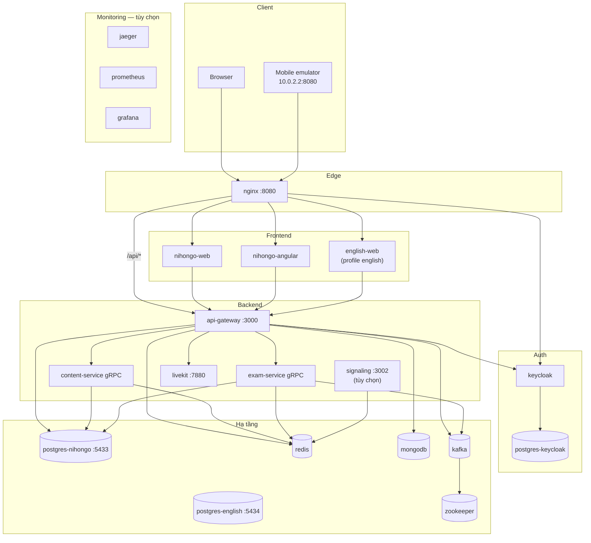

# Docker — chạy stack & chuyển sang máy khác

Hướng dẫn dùng `docker compose` cho monorepo `edu_app`: mỗi container làm gì, chạy từng phần, và deploy sang máy mới.

> **Học Docker từ đầu (khái niệm + lệnh + stack này):** [learn-docker.md](./learn-docker.md).  
> Dev hàng ngày (nhẹ hơn Docker full app): [run-local.md](./run-local.md) — chỉ Docker infra + `npm run dev:*`.  
> Mobile emulator gọi API qua nginx `:8080`: [run-mobile.md](./run-mobile.md), [nginx.md](./nginx.md).  
> Tài khoản mặc định: [accounts.md](./accounts.md).

Compose file: [`docker-compose.yml`](../docker-compose.yml) · Env mẫu: [`.env.docker.example`](../.env.docker.example)

---

## Yêu cầu máy đích

| Công cụ | Ghi chú |
| --- | --- |
| **Docker Desktop** hoặc Docker Engine + Compose v2 | Windows / macOS / Linux |
| **Git** | Clone repo (cách khuyên dùng) |
| **RAM** | Tối thiểu ~4 GB (Nihongo); full + Kafka + Keycloak + LiveKit ~6–8 GB |

---

## Checklist — chỉ học Nihongo (Docker full)

Một lệnh:

```powershell
npm run docker:up:nihongo
```

Script hiện tại:

```text
docker compose up -d postgres-nihongo redis mongodb zookeeper kafka
  content-service exam-service api-gateway nihongo-web nihongo-angular nginx
```

Compose **tự kéo thêm** các dependency của `api-gateway` / `nginx`:

- `postgres-keycloak` → `keycloak`
- `livekit`

### Container cần chạy (~14)

| # | Service Compose | Tên container | Port host | Vì sao cần |
| --- | --- | --- | --- | --- |
| 1 | `postgres-nihongo` | `edu-postgres-nihongo` | **5433** | DB tiếng Nhật (vocab, user, payment, SRS…) |
| 2 | `redis` | `edu-redis` | 6379 | Cache, session, rate-limit |
| 3 | `mongodb` | `edu-mongodb` | 27017 | Audit / notification ([mongodb.md](./mongodb.md)) |
| 4 | `zookeeper` | `edu-zookeeper` | — | Kafka cần |
| 5 | `kafka` | `edu-kafka` | 9092 | Event thi thử / async |
| 6 | `postgres-keycloak` | `edu-postgres-keycloak` | — | DB riêng cho Keycloak |
| 7 | `keycloak` | `edu-keycloak` | qua nginx | OIDC (realm `edu-app`) |
| 8 | `livekit` | `edu-livekit` | **7880** (+ UDP) | Livestream (mobile / web) |
| 9 | `content-service` | `edu-content` | gRPC 50051 | Nội dung JP |
| 10 | `exam-service` | `edu-exam` | gRPC 50052 | Mock JLPT, quiz |
| 11 | `api-gateway` | `edu-gateway` | **3000** | REST API, auth, Swagger |
| 12 | `nihongo-web` | `edu-nihongo-web` | qua nginx | Frontend Next.js |
| 13 | `nihongo-angular` | `edu-nihongo-angular` | qua nginx | Frontend Angular |
| 14 | `nginx` | `edu-nginx` | **8080** | Cổng vào duy nhất |

Kiểm tra nhanh:

```powershell
docker ps --filter "name=edu-" --format "table {{.Names}}\t{{.Status}}\t{{.Ports}}"
```

### Container **không** nằm trong `docker:up:nihongo`

| Service | Tên container | Ghi chú |
| --- | --- | --- |
| `postgres-english` | `edu-postgres-english` | Profile `english` |
| `english-web` | `edu-english-web` | Profile `english` |
| `signaling-service` | `edu-signaling` | Video call WebRTC (port **3002**) — bật riêng |
| `jaeger` / `prometheus` / `grafana` | `edu-jaeger`… | Monitoring — bật riêng |

### Mở app

| Mục | URL |
| --- | --- |
| Nihongo Next | [http://localhost:8080](http://localhost:8080) |
| Nihongo Angular | [http://nihongo-angular.localhost:8080](http://nihongo-angular.localhost:8080) |
| Keycloak | [http://auth.localhost:8080](http://auth.localhost:8080) |
| API / Swagger | [http://localhost:3000/api/docs](http://localhost:3000/api/docs) |
| API qua nginx | [http://localhost:8080/api/…](http://localhost:8080/api/) |
| LiveKit WS | `ws://localhost:7880` (emulator: `ws://10.0.2.2:7880`) |

Login mặc định: `admin@nihongo.local` / `admin123` — chi tiết [accounts.md](./accounts.md).

### Tắt stack

```powershell
npm run docker:down
```

---

## Bản đồ container


```mermaid
flowchart TB
  subgraph client [Client]
    Browser
    Mobile["Mobile emulator\n10.0.2.2:8080"]
  end

  subgraph edge [Edge]
    Nginx["nginx :8080"]
  end

  subgraph apps [Frontend]
    NW["nihongo-web"]
    NA["nihongo-angular"]
    EW["english-web\n(profile english)"]
  end

  subgraph auth [Auth]
    KC["keycloak"]
    PGC[(postgres-keycloak)]
  end

  subgraph api [Backend]
    GW["api-gateway :3000"]
    CS["content-service gRPC"]
    ES["exam-service gRPC"]
    SIG["signaling :3002\n(tùy chọn)"]
    LK["livekit :7880"]
  end

  subgraph infra [Hạ tầng]
    PG[(postgres-nihongo :5433)]
    PGE[(postgres-english :5434)]
    RD[(redis)]
    MG[(mongodb)]
    KF[(kafka)]
    ZK[(zookeeper)]
  end

  subgraph obs [Monitoring — tùy chọn]
    JG[jaeger]
    PR[prometheus]
    GF[grafana]
  end

  Browser --> Nginx
  Mobile --> Nginx
  Nginx --> NW
  Nginx --> NA
  Nginx --> EW
  Nginx --> KC
  Nginx -->|"/api/*"| GW
  NW --> GW
  NA --> GW
  EW --> GW
  GW --> CS
  GW --> ES
  GW --> PG
  GW --> RD
  GW --> MG
  GW --> KF
  GW --> KC
  GW --> LK
  KC --> PGC
  CS --> PG
  CS --> RD
  ES --> PG
  ES --> RD
  ES --> KF
  KF --> ZK
  SIG --> RD
```

---

## Từng container — làm gì?

### Hạ tầng dữ liệu & message

| Container | Tên Docker | Port host | Vai trò |
| --- | --- | --- | --- |
| **postgres-nihongo** | `edu-postgres-nihongo` | **5433** → 5432 | DB `nihongo`. Volume **external** `nihongo-app_postgres_data`. |
| **postgres-english** | `edu-postgres-english` | **5434** → 5432 | Profile `english`. Volume `postgres_english_data`. |
| **postgres-keycloak** | `edu-postgres-keycloak` | — | DB riêng Keycloak. Volume `postgres_keycloak_data`. |
| **redis** | `edu-redis` | 6379 | Cache, session, rate-limit, signaling. |
| **mongodb** | `edu-mongodb` | 27017 | Audit DB `nihongo_audit`. Gateway phụ thuộc khi chạy Docker. |
| **zookeeper** | `edu-zookeeper` | nội bộ | Điều phối Kafka. |
| **kafka** | `edu-kafka` | 9092 | Event async; exam + gateway cần. |

### Auth & realtime

| Container | Tên Docker | Port host | Vai trò |
| --- | --- | --- | --- |
| **keycloak** | `edu-keycloak` | qua nginx `:8080` | OIDC realm `edu-app` (import `infra/keycloak/realm-edu-app.json`). |
| **livekit** | `edu-livekit` | **7880**, 7881, UDP 50100–50200 | Livestream; config `infra/livekit.yaml`. |
| **signaling-service** | `edu-signaling` | **3002** | WebSocket WebRTC — **không** nằm trong `docker:up:nihongo`. |

### Backend (NestJS / gRPC)

| Container | Tên Docker | Port host | Vai trò |
| --- | --- | --- | --- |
| **content-service** | `edu-content` | gRPC 50051 | Từ vựng, ngữ pháp, đọc/nghe JP. |
| **exam-service** | `edu-exam` | gRPC 50052 | Mock JLPT, quiz. |
| **api-gateway** | `edu-gateway` | **3000** | REST + Swagger `/api/docs`, JWT, Keycloak, Stripe, LiveKit token, Brevo… |

### Frontend & edge

| Container | Tên Docker | Port host | Vai trò |
| --- | --- | --- | --- |
| **nihongo-web** | `edu-nihongo-web` | qua nginx | Next.js học tiếng Nhật. |
| **nihongo-angular** | `edu-nihongo-angular` | qua nginx | Angular client (`nihongo-angular.localhost`). |
| **english-web** | `edu-english-web` | qua nginx | Profile `english`. |
| **nginx** | `edu-nginx` | **8080** → 80 | Reverse proxy theo host/path. Chi tiết: [nginx.md](./nginx.md). |

### Monitoring (tùy chọn)

| Container | Tên Docker | Port host | Vai trò |
| --- | --- | --- | --- |
| **jaeger** | `edu-jaeger` | 16686, 4318 | Trace OTEL. |
| **prometheus** | `edu-prometheus` | 9090 | Metrics. |
| **grafana** | `edu-grafana` | **4000** | Dashboard (`admin` / `admin`). |

---

## URL sau khi chạy

| Mục | URL |
| --- | --- |
| Nihongo (nginx) | [http://localhost:8080](http://localhost:8080) |
| Nihongo Angular | [http://nihongo-angular.localhost:8080](http://nihongo-angular.localhost:8080) |
| English | [http://english.localhost:8080](http://english.localhost:8080) *(profile `english`)* |
| Keycloak | [http://auth.localhost:8080](http://auth.localhost:8080) |
| API / Swagger | [http://localhost:3000/api/docs](http://localhost:3000/api/docs) |
| API qua nginx | [http://localhost:8080/api/…](http://localhost:8080/api/) |
| Health | [http://localhost:8080/health](http://localhost:8080/health) hoặc `:3000/health` |
| LiveKit | `ws://localhost:7880` |
| Signaling | [http://localhost:3002](http://localhost:3002) |
| Grafana | [http://localhost:4000](http://localhost:4000) |
| Postgres Nihongo | `localhost:5433`, user/pass `nihongo`, DB `nihongo` |
| Postgres English | `localhost:5434`, user/pass `english`, DB `english_learning` |

**hosts file** (khuyên dùng cho Keycloak / Angular):

```
127.0.0.1 nihongo.localhost english.localhost auth.localhost nihongo-angular.localhost
```

Android emulator: `10.0.2.2:8080` → nginx (API + path Keycloak). iOS simulator: thường `localhost:3000` hoặc gateway trực tiếp — xem [run-mobile.md](./run-mobile.md).

---

## Chạy service nào?

### Script NPM

```powershell
# Chỉ hạ tầng (kết hợp npm run dev:* — xem run-local.md)
npm run docker:up:infra
# = postgres-nihongo redis mongodb zookeeper kafka
# (chưa Keycloak/LiveKit — hybrid local thường chạy thêm khi cần OIDC/live)

# Infra + Postgres English
npm run docker:up:infra:full

# Stack học tiếng Nhật (Docker full app)
npm run docker:up:nihongo
# kéo thêm keycloak + livekit qua depends_on

# Toàn bộ + english-web
npm run docker:up:build   # --profile english --build
npm run docker:up         # --profile english (không rebuild)

npm run docker:down
```

### Bảng gợi ý

| Mục đích | Lệnh / service |
| --- | --- |
| **Chỉ DB/cache** + `npm run dev:*` | `npm run docker:up:infra` |
| **+ Keycloak (hybrid)** | thêm `postgres-keycloak keycloak` (và hosts `auth.localhost`) |
| **+ LiveKit (hybrid)** | thêm `livekit` |
| **Học Nihongo Docker full** | `npm run docker:up:nihongo` |
| **+ Tiếng Anh** | `.env`: `ENGLISH_ENABLED=true` + `docker compose --profile english up -d` |
| **+ Video call** | thêm `signaling-service` (+ `NEXT_PUBLIC_SIGNALING_URL` khi **build** `nihongo-web`) |
| **+ Monitoring** | thêm `jaeger prometheus grafana` |
| **Không tắt exam/kafka** | Gateway health cần `exam` + Kafka healthy |

### Lệnh thủ công

```powershell
cd C:\path\to\edu_app

copy .env.docker.example .env

# Volume Postgres Nihongo (external — bắt buộc lần đầu)
docker volume create nihongo-app_postgres_data

# Stack Nihongo (Compose tự start keycloak + livekit)
docker compose up -d postgres-nihongo redis mongodb zookeeper kafka `
  content-service exam-service api-gateway nihongo-web nihongo-angular nginx

docker compose ps
docker compose logs -f api-gateway

docker compose down
# ⚠️ mất data volume non-external:
docker compose down -v
```

### Chỉ build lại một image

```powershell
docker compose build nihongo-web
docker compose up -d nihongo-web nginx

# Angular
npm run docker:build:nihongo-angular
```

Sau khi đổi `NEXT_PUBLIC_*` / Keycloak public URL, cần **rebuild** frontend vì biến bake lúc build.

---

## Cấu hình môi trường

Copy `.env.docker.example` → `.env` ở thư mục gốc:

```env
POSTGRES_PASSWORD=nihongo
ENGLISH_ENABLED=false
JWT_SECRET=doi-trong-production
NGINX_HTTP_PORT=8080
ADMIN_EMAIL=admin@nihongo.local
ADMIN_PASSWORD=admin123

KEYCLOAK_ADMIN=admin
KEYCLOAK_ADMIN_PASSWORD=admin
KEYCLOAK_URL=http://keycloak:8080
KEYCLOAK_ISSUER=http://auth.localhost:8080/realms/edu-app
NEXT_PUBLIC_KEYCLOAK_URL=http://auth.localhost:8080

ALLOWED_ORIGINS=http://localhost:8080,http://nihongo.localhost:8080,http://auth.localhost:8080,...
```

`docker compose` tự đọc `.env`. LiveKit dev key mặc định trong compose: `devkey` / `devsecret`.

---

## Restore / backup DB

Snapshot trong repo (cập nhật gần nhất):

```powershell
# Backup mới
npm run db:backup

# Restore Nihongo
Get-Content infra\backups\nihongo_20260725_144146.sql |
  docker exec -i edu-postgres-nihongo psql -U nihongo nihongo
```

Chi tiết: [infra/backups/README.md](../infra/backups/README.md).

---

## Chuyển stack sang máy khác

Không “copy container” — chuyển **image + data + cấu hình**.

### Cách 1 — Clone repo + build (khuyên dùng)

**Máy cũ — backup**

```powershell
npm run db:backup
# hoặc
docker exec edu-postgres-nihongo pg_dump -U nihongo nihongo > nihongo_backup.sql
```

**Máy mới**

```powershell
git clone <url-repo> edu_app
cd edu_app
copy .env.docker.example .env
# Chỉnh JWT_SECRET, POSTGRES_PASSWORD, NGINX_HTTP_PORT, Keycloak public URL…

docker volume create nihongo-app_postgres_data

npm run docker:up:nihongo

# Đợi postgres healthy rồi restore
Get-Content infra\backups\nihongo_20260725_144146.sql |
  docker exec -i edu-postgres-nihongo psql -U nihongo nihongo
```

**Media (KanjiVG, OpenMoji)** nằm trong image `nihongo-web` nếu build sau `media:sync`. Nếu thiếu `apps/nihongo-web/public/media`:

```powershell
npm install
npm run media:setup
docker compose build nihongo-web
```

---

### Cách 2 — Export / import images (không build trên máy mới)

**Máy cũ**

```powershell
docker compose build

docker save -o edu-images.tar `
  edu-app-api-gateway edu-app-content-service edu-app-exam-service `
  edu-app-nihongo-web edu-app-nihongo-angular edu-app-nginx `
  edu-app-signaling-service

# Gửi edu-images.tar + repo (compose, infra/, .env) + SQL backup
```

**Máy mới**

```powershell
docker load -i edu-images.tar
git clone <url> edu_app
cd edu_app
copy .env.docker.example .env
docker volume create nihongo-app_postgres_data

docker compose up -d postgres-nihongo redis mongodb zookeeper kafka `
  content-service exam-service api-gateway nihongo-web nihongo-angular nginx
# keycloak + livekit kéo theo depends_on

# Restore SQL như Cách 1
```

Image infra (`postgres`, `redis`, `kafka`, `keycloak`, `livekit`…) máy mới `docker pull` lần đầu.

---

### Cách 3 — Docker Registry (production)

```powershell
docker tag edu-app-nihongo-web myregistry/edu-nihongo-web:latest
docker push myregistry/edu-nihongo-web:latest
# Sửa compose dùng image: thay build: → docker compose pull && up -d
```

---

### Chuyển volume Postgres nguyên khối

```powershell
# Máy cũ
docker compose stop postgres-nihongo
docker run --rm -v nihongo-app_postgres_data:/data -v ${PWD}:/backup alpine `
  tar czf /backup/postgres_volume.tar.gz -C /data .

# Máy mới
docker volume create nihongo-app_postgres_data
docker run --rm -v nihongo-app_postgres_data:/data -v ${PWD}:/backup alpine `
  tar xzf /backup/postgres_volume.tar.gz -C /data
```

---

## Checklist máy mới

1. Docker đã cài và chạy  
2. `docker volume create nihongo-app_postgres_data`  
3. File `.env` từ `.env.docker.example` (+ hosts `auth.localhost`, …)  
4. Restore SQL hoặc copy volume  
5. `npm run docker:up:nihongo`  
6. Mở [http://localhost:8080](http://localhost:8080) — login [accounts.md](./accounts.md)  
7. `curl http://localhost:3000/health` → `"exam":"up","content":"up"`  
8. Keycloak: [http://auth.localhost:8080](http://auth.localhost:8080) (admin / admin)  

---

## Xử lý lỗi thường gặp

| Triệu chứng | Cách xử lý |
| --- | --- |
| **502 Bad Gateway** (nginx) | Web/gateway/keycloak chưa ready — đợi ~30–60s hoặc `docker compose restart nginx` |
| **Volume external not found** | `docker volume create nihongo-app_postgres_data` |
| **Port 8080 đã dùng** | `NGINX_HTTP_PORT=8888` trong `.env`, `docker compose up -d nginx` |
| **CORS / login lỗi** | `ALLOWED_ORIGINS` khớp URL trình duyệt (`:8080`, `auth.localhost`) |
| **Keycloak không mở** | Thêm hosts `auth.localhost`; kiểm `docker ps` có `edu-keycloak` |
| **OIDC mobile lỗi** | Emulator dùng `10.0.2.2:8080` qua nginx — xem [nginx.md](./nginx.md) |
| **Live / LiveKit lỗi** | Kiểm `edu-livekit` + `LIVEKIT_PUBLIC_URL` (`ws://10.0.2.2:7880` trên emulator) |
| **Thiếu ảnh / KanjiVG** | `npm run media:setup` rồi rebuild `nihongo-web` |
| **Gateway restart loop** | `docker compose logs api-gateway` — thiếu DB, Kafka, Mongo, Keycloak hoặc LiveKit |
| **Symlink / Nest build trong Docker** | Image phải copy package thật, không symlink monorepo Windows (tránh 502) |

---

## Liên quan

| File | Nội dung |
| --- | --- |
| [run-local.md](./run-local.md) | Dev hybrid (infra Docker + `npm run dev:*`) |
| [run-mobile.md](./run-mobile.md) | Chạy 4 app mobile + API base URL |
| [nginx.md](./nginx.md) | Routing hostname / path / emulator |
| [accounts.md](./accounts.md) | User/password local |
| [mongodb.md](./mongodb.md) | Audit MongoDB |
| [infra/backups/README.md](../infra/backups/README.md) | Backup / restore SQL |
| [system-design.md](./system-design.md) | Kiến trúc tổng thể |
| [roadmap-angular.md](./roadmap-angular.md) | Lộ trình học Angular (`nihongo-angular`) |
| `.env.docker.example` | Biến môi trường Compose |
