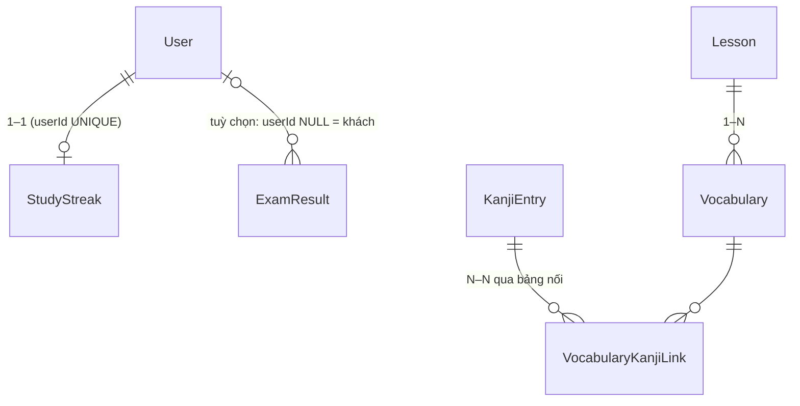
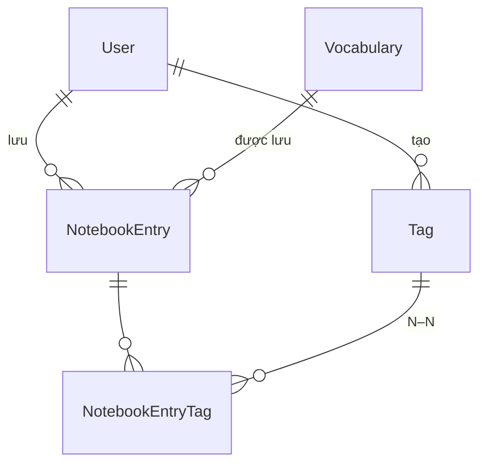
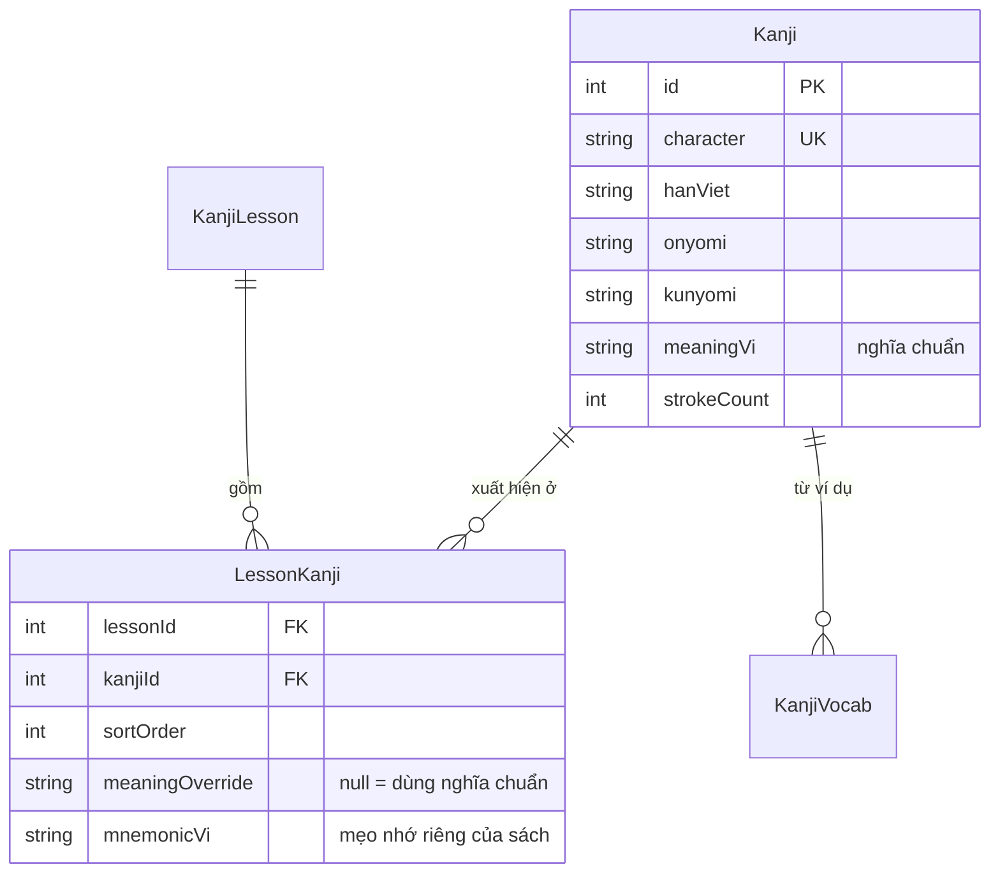

# Học Phân tích & Thiết kế CSDL — Từ Project Này

> Học cách đi từ **yêu cầu** → **bảng** bằng chính các quyết định thiết kế của DB `nihongo`
> (107 bảng — sơ đồ ở [db-erd.md](./db-erd.md), mô tả ở [db-design.md](./db-design.md)).
> Mỗi phần có: lý thuyết ngắn → ví dụ trong project → **kiểm chứng bằng SQL trên dữ liệu thật**.
> Viết SQL: [learn-sql.md](./learn-sql.md) · hiệu năng/index: [learn-postgres.md](./learn-postgres.md).

> **Cập nhật 2026-09-29:** soát toàn schema tìm thấy **6** index thừa (không chỉ `DailyGoal`): trùng hẳn UNIQUE ở `DailyGoal`,
> `DailyNote`, `ListeningLog`, `StudySession`; là tiền tố của UNIQUE ở `DailyActivity (userId, date)`, `KanaCell (sectionId)` —
> đã xoá trong migration `20260929120000_outbox_drop_redundant_indexes` (cùng migration thêm bảng `OutboxEvent`).

## 0. Quy trình tổng quát

```
1. Phân tích yêu cầu      "app cần LƯU gì, TRẢ LỜI câu hỏi gì?"
2. Thực thể & thuộc tính   danh từ → bảng, tính chất → cột
3. Quan hệ & bản số        1–1, 1–N, N–N, bắt buộc hay tuỳ chọn
4. ERD khái niệm           vẽ ra, soát với yêu cầu            (mermaid: db-erd.md)
5. Chuẩn hoá               bỏ trùng lặp, bỏ bất thường cập nhật (1NF → 3NF)
6. Phi chuẩn hoá có chủ đích  vì hiệu năng / lịch sử — ghi rõ lý do
7. Thiết kế vật lý         kiểu dữ liệu, khoá, ràng buộc, index
8. Migration & dữ liệu mẫu  schema.prisma → migration SQL → seed
9. Kiểm chứng              viết các truy vấn chính, EXPLAIN, dữ liệu thật
```

Thiết kế DB là **lặp**: bước 9 thường đẩy ngược về bước 2–7.

---

## 1. Phân tích yêu cầu → câu hỏi dữ liệu

Bắt đầu từ tính năng, viết thành **câu hỏi** mà DB phải trả lời được:

| Tính năng | Câu hỏi dữ liệu | Hệ quả thiết kế |
|-----------|------------------|-----------------|
| Học từ vựng theo bài | "Các từ của bài 5, đúng thứ tự?" | `Vocabulary.lessonId` + `sortOrder` |
| Tra từ trên mọi bài | "Từ nào có kana/nghĩa chứa X, ở bài nào?" | tìm trên `Vocabulary`, JOIN `Lesson` |
| Ôn tập SRS | "Thẻ nào của user đến hạn ôn hôm nay?" | `SrsCard(userId, nextReviewAt)` + index |
| Học theo giáo trình | "Bài Sou Matome N3 tuần 2?" | `Lesson.textbook` + quy ước `lessonNumber` |
| Chuỗi ngày học | "User học liên tục bao nhiêu ngày?" | `StudyStreak` 1–1 với `User` |
| Thanh toán coach | "Buổi học này đã trả bao nhiêu, lúc đặt giá bao nhiêu?" | `Payment`, giá **snapshot** trong `CoachingSession` |

Mẹo: **danh từ** trong câu hỏi → ứng viên thực thể/thuộc tính; **động từ** → quan hệ.

---

## 2. Thực thể, thuộc tính, khoá

### 2.1. Khoá tự nhiên vs khoá thay thế (surrogate)

Mọi bảng trong project dùng `id Int @id @default(autoincrement())` (surrogate), nhưng vẫn giữ khoá tự nhiên
là **UNIQUE**:

```
Lesson.id            ← surrogate: khoá ngoại trỏ vào đây, không bao giờ đổi
Lesson.lessonNumber  ← khoá tự nhiên, UNIQUE: người dùng/URL dùng ("/vocab?lesson=5")
User.email           ← UNIQUE
TextbookSeries.code  ← UNIQUE (MINNA, SOUMATOME, …)
```

Lý do: khoá tự nhiên có thể phải đổi (đánh số lại bài, user đổi email) — nếu nó là khoá chính thì mọi
khoá ngoại phải đổi theo.

### 2.2. "Smart key" — mã mang ý nghĩa

Bài giáo trình được đánh số theo quy ước:

```
lessonNumber = gốc sách + cấp × 1000 + phần × 100 + bài
   Sou Matome N1, tuần 1, ngày 1  → 20000 + 1×1000 + 1×100 + 1 = 21101
   TRY! N5, phần 1, chương 2       → 40000 + 5×1000 + 1×100 + 2 = 45102
```

| Ưu | Nhược |
|----|-------|
| nhìn số là biết sách/cấp; sắp xếp tự nhiên | **thông tin nằm trong con số** — phải "giải mã" ở code |
| không cần thêm cột | giới hạn cứng: tối đa 9 phần × 99 bài; thêm sách mới phải chọn gốc mới |
| | dễ trùng nếu 2 quy ước chồng nhau |

Cách "sạch" hơn: cột riêng `textbook`, `level`, `section`, `unit` + UNIQUE trên tổ hợp đó.
Project **đã có** `textbook` và `jlptLevel` riêng; con số chỉ còn là nhãn — chấp nhận được, nhưng code
**không nên** tính cấp độ ngược từ `lessonNumber`.

---

## 3. Quan hệ & bản số



| Loại | Cách làm trong project | Ràng buộc then chốt |
|------|------------------------|---------------------|
| **1–1** | `StudyStreak.userId` | FK + **UNIQUE** (thiếu UNIQUE thì thành 1–N) |
| **1–N** | `Vocabulary.lessonId → Lesson.id` | FK ở phía "nhiều" |
| **N–N** | `VocabularyKanjiLink(vocabularyId, kanjiEntryId)` | 2 FK + **UNIQUE cặp** (không nối trùng) |
| **Tuỳ chọn** | `ExamResult.userId` cho phép NULL | khách làm bài không cần tài khoản |

Kiểm chứng N–N:

```sql
SELECT v."kanji", k."character", k."hanViet"
FROM "Vocabulary" v
JOIN "VocabularyKanjiLink" vk ON vk."vocabularyId" = v.id
JOIN "KanjiEntry" k           ON k.id = vk."kanjiEntryId"
WHERE v."kanji" = '日本';
--  日本 | 日 | NHẬT
--  日本 | 本 | BẢN
```

**Xoá cha thì con ra sao?** (`onDelete` trong Prisma)

| Chọn | Nghĩa | Dùng khi | Project |
|------|-------|----------|---------|
| `Cascade` | xoá cha → xoá luôn con | con không có nghĩa khi thiếu cha (từ của bài, item của mục tiêu ngày) | 56 quan hệ |
| `SetNull` | xoá cha → FK con thành NULL | con vẫn cần giữ (lịch sử, audit) | 3 quan hệ |
| `Restrict` (mặc định) | chặn xoá cha nếu còn con | dữ liệu quan trọng, không được xoá nhầm | còn lại |

---

## 4. Chuẩn hoá (Normalization)

Mục tiêu: **mỗi sự thật lưu đúng một chỗ** → tránh bất thường khi thêm/sửa/xoá.

### 4.1. 1NF — mỗi ô một giá trị nguyên tử, không nhóm lặp

**Ví dụ thật — mục tiêu ngày (`DailyGoal`).** Thiết kế cũ lưu danh sách việc trong một cột JSON:

```
DailyGoal (cũ):  id | userId | date       | items (Json)
                  1 |   7    | 2026-06-26 | [{"text":"Học 10 từ","done":false},{"text":"Nghe 15 phút","done":true}]
```

Vấn đề: đánh dấu **một** việc là xong phải đọc cả mảng, sửa, ghi lại cả mảng (2 tab cùng sửa → mất dữ liệu);
không đếm được "bao nhiêu việc đã xong trong tháng" bằng SQL đơn giản.

Thiết kế mới (migration *v3 redesign*) tách thành bảng con:

```
DailyGoal:      id | userId | date
DailyGoalItem:  id | goalId | text          | done  | sortOrder
                 1 |   1    | Học 10 từ      | false |   0
                 2 |   1    | Nghe 15 phút   | true  |   1
```

`PATCH /daily-goal/:id/items/:itemId` giờ chỉ `UPDATE` **một dòng**.

**Chỗ còn "vi phạm" có chủ đích:** `Vocabulary.kana` như `つま／かない` chứa 2 cách đọc trong một ô.
Được chấp nhận vì đó là **chuỗi hiển thị** giống sách, không ai truy vấn riêng từng cách đọc. Nếu cần
tra theo từng cách đọc → tách bảng `VocabularyReading`.

### 4.2. 2NF — cột phụ thuộc vào **toàn bộ** khoá (khi khoá gồm nhiều cột)

`DailyActivity` có khoá duy nhất `(userId, date, kind)`; cột `count` phụ thuộc cả 3 → đạt 2NF.
Nếu thêm cột `userName` vào đây → chỉ phụ thuộc `userId` (một phần khoá) → vi phạm 2NF: đổi tên user
phải sửa hàng nghìn dòng hoạt động.

### 4.3. 3NF — không phụ thuộc bắc cầu (cột không-khoá phụ thuộc cột không-khoá khác)

`Vocabulary.jlptLevel` **suy ra được** từ `Lesson.jlptLevel` (từ → bài → cấp) → về lý thuyết vi phạm 3NF.
Project vẫn giữ (phi chuẩn hoá, mục 5) để lọc "kho từ theo cấp" không cần JOIN. Kiểm chứng hiện trạng:

```sql
SELECT COUNT(*) AS tong,
       COUNT(*) FILTER (WHERE v."jlptLevel" IS DISTINCT FROM l."jlptLevel") AS lech
FROM "Vocabulary" v JOIN "Lesson" l ON l.id = v."lessonId";
--  tong  | lech
-- 13973  |    0      ← hiện khớp 100%, nhưng DB KHÔNG đảm bảo điều này
```

Đây là cái giá của phi chuẩn hoá: phải có **cơ chế giữ đồng bộ** (seed/code luôn gán cùng lúc, hoặc trigger,
hoặc truy vấn kiểm tra định kỳ như trên).

---

## 5. Phi chuẩn hoá có chủ đích

Phi chuẩn hoá **không phải lỗi** nếu có lý do và có cách kiểm soát. Ba ví dụ trong project:

### 5.1. Snapshot giá — lưu lịch sử đúng

`CoachingSession.priceUsdCents` chép giá của coach **tại lúc đặt lịch**, thay vì JOIN sang `CoachProfile`.
Coach tăng giá tuần sau → buổi đã đặt vẫn giữ giá cũ. Đây là **đúng nghiệp vụ**, không phải trùng lặp:
giá lúc đặt là một *sự thật khác* với giá hiện tại.

### 5.2. Cột lọc nhanh — `Vocabulary.jlptLevel`

Đã phân tích ở 4.3: đổi 1 JOIN lấy tốc độ + truy vấn đơn giản, chấp nhận rủi ro lệch.

### 5.3. Kanji lưu theo từng bài — 3.675 dòng cho 2.222 chữ

```sql
SELECT COUNT(*) AS so_dong, COUNT(DISTINCT "character") AS so_chu FROM "KanjiEntry";
--  3675 | 2222
```

Chữ `乗` nằm ở bài KLL, bài Sou Matome, bài Shinkanzen — mỗi nơi **một dòng riêng** (Hán-Việt, âm đọc, nghĩa
lặp lại):

```sql
SELECT l."textbook", l."lessonNumber", e."hanViet", e."meaningVi"
FROM "KanjiEntry" e JOIN "KanjiLesson" l ON l.id = e."lessonId"
WHERE e."character" = '乗';
--  KLL        |    12 | THỪA | lên xe
--  SOUMATOME  | 24601 | THỪA | lên (xe)      ← 3 bản sao đã bắt đầu lệch nhau về cách viết nghĩa
--  SHINKANZEN | 34311 | THỪA | lên (xe)
```

Hai thiết kế:

```
A. Hiện tại:  KanjiLesson 1──N KanjiEntry            (entry thuộc đúng 1 bài)
B. Chuẩn hoá: KanjiLesson 1──N LessonKanji N──1 Kanji   (Kanji: mỗi chữ 1 dòng; bài chỉ tham chiếu)
```

| | A (hiện tại) | B (chuẩn hoá) |
|---|--------------|----------------|
| Sửa nghĩa chữ 乗 | sửa 3 chỗ, dễ lệch | sửa 1 chỗ |
| Mỗi sách có mẹo nhớ / thứ tự riêng | dễ (cột nằm ngay trong entry) | đặt ở `LessonKanji` |
| Truy vấn "các chữ của bài X" | 1 bảng | JOIN 2 bảng |
| Thẻ SRS kanji | trỏ vào entry → 1 chữ có thể thành 3 thẻ ⚠️ | trỏ vào `Kanji` → 1 chữ 1 thẻ |

Nếu làm lại từ đầu, **B** hợp hơn cho SRS; A đơn giản khi nhập nội dung theo từng sách. Đây là loại
phân tích cần ghi vào tài liệu thiết kế: *chọn gì, vì sao, đổi lại mất gì*.

---

## 6. Thiết kế vật lý: kiểu dữ liệu

| Quy tắc | Trong project | Lý do |
|---------|---------------|-------|
| Tiền dùng **số nguyên đơn vị nhỏ nhất** | `amountCents Int`, `priceUsdCents Int` | `Float` sai số: `0.1 + 0.2 ≠ 0.3` |
| Giá trị cố định → **ENUM** | `JlptLevel`, `Role`, `PaymentStatus` | DB tự chặn giá trị lạ |
| Danh mục có thể thêm bớt → **bảng tra cứu** | `TextbookSeries`, `SubscriptionPlanConfig` | thêm dòng, không cần migration |
| Ngày → kiểu `date`; thời điểm → `timestamptz` | xem phản ví dụ dưới | so sánh/tính toán đúng, có kiểm tra hợp lệ |

**Phản ví dụ thật — kiểu ngày không nhất quán:**

```sql
SELECT table_name, column_name, data_type
FROM information_schema.columns
WHERE table_schema = 'public' AND column_name IN ('date', 'lastStudyDate');
--  DailyActivity | date          | text   ⚠️
--  DailyGoal     | date          | text   ⚠️
--  DailyNote     | date          | text   ⚠️
--  StudyStreak   | lastStudyDate | text   ⚠️
--  ListeningLog  | date          | date   ✅
--  StudySession  | date          | date   ✅
```

Lưu ngày dạng `text` ('2026-09-29'): DB không chặn được `'2026-13-45'` hay `'29/09/2026'`, muốn tính
"hôm qua" phải ép kiểu. Lý do có thể là để lưu **ngày theo giờ Việt Nam** (tránh lệch múi giờ) — mục đích
đúng, nhưng kiểu `date` làm được việc đó mà vẫn có kiểm tra.

**ENUM vs bảng tra cứu — trường hợp `Textbook`:** project có **cả hai**: enum `Textbook` (trên `Lesson.textbook`)
và bảng `TextbookSeries` (có `code Textbook`). Thêm một bộ sách mới = sửa enum (**migration**) + thêm dòng.
Nếu `Lesson` trỏ FK tới `TextbookSeries.id` thì thêm sách chỉ là **thêm dòng**. Enum hợp khi tập giá trị
gần như không đổi (`JlptLevel` N5–N1); danh sách "sản phẩm" thì nên là bảng.

---

## 7. JSON(B) hay bảng?

| Dùng JSONB khi… | Dùng bảng khi… |
|-----------------|----------------|
| đọc/ghi **cả khối** một lần | cần sửa **từng phần tử** |
| cấu trúc linh hoạt, ít khi truy vấn bên trong | cần lọc/đếm/JOIN theo phần tử |
| không cần ràng buộc (FK, UNIQUE) bên trong | cần FK, UNIQUE, NOT NULL cho phần tử |

Hai ví dụ đối lập trong project:

- ✅ `MindMapLevel.branches` (JSONB): cây sơ đồ tư duy được **admin sửa cả cây** và web **đọc cả cây** —
  không ai hỏi "nhánh nào có > 5 mục trên toàn hệ thống".
- ❌ `DailyGoal.items` (JSON, bản cũ): cần tick từng việc → đã tách bảng (mục 4.1).
- ✅ `WebhookEvent.payload` (JSON): lưu nguyên văn dữ liệu Stripe gửi để debug/đối soát — không cần cấu trúc.

---

## 8. Quan hệ đa hình (polymorphic) — `SrsCard`

Một thẻ ôn tập có thể là từ vựng, ngữ pháp hoặc kanji:

```
SrsCard: userId | contentType (VOCABULARY|GRAMMAR|KANJI) | contentId
                                                          └─ trỏ tới Vocabulary.id / Grammar.id / KanjiEntry.id
```

`contentId` **không có khoá ngoại** (một cột không thể FK tới 3 bảng) → DB không bảo vệ được:
xoá một từ vựng thì thẻ SRS của nó thành **mồ côi**. Kiểm tra:

```sql
SELECT s."contentType", COUNT(*) AS tong,
       COUNT(*) FILTER (WHERE s."contentType" = 'VOCABULARY'
                        AND NOT EXISTS (SELECT 1 FROM "Vocabulary" v WHERE v.id = s."contentId")) AS mo_coi
FROM "SrsCard" s GROUP BY 1;
--  VOCABULARY | 1201 | 0      ← hiện chưa có thẻ mồ côi, nhưng chỉ nhờ may mắn/code cẩn thận
```

Các cách thiết kế khác:

```
A. Hiện tại   : (contentType, contentId), không FK           — đơn giản, không toàn vẹn
B. Nhiều cột  : vocabularyId?, grammarId?, kanjiEntryId?      — mỗi cột có FK + ON DELETE CASCADE
                + CHECK (đúng MỘT cột khác NULL)
C. Bảng riêng : SrsVocabCard, SrsGrammarCard, SrsKanjiCard     — FK đầy đủ, nhưng truy vấn "thẻ đến hạn"
                phải UNION 3 bảng
```

Phương án **B** thường là cân bằng tốt nhất. CHECK constraint Prisma chưa khai báo được trong schema →
viết thẳng vào file migration SQL:

```sql
ALTER TABLE "SrsCard" ADD CONSTRAINT srs_one_target CHECK (
  num_nonnulls("vocabularyId", "grammarId", "kanjiEntryId") = 1
);
```

---

## 9. Ràng buộc = luật nghiệp vụ nằm trong DB

Code có thể có bug; ràng buộc trong DB là lưới an toàn cuối cùng.

| Luật nghiệp vụ | Ràng buộc |
|----------------|-----------|
| Một user chỉ có một chuỗi ngày học | `StudyStreak.userId UNIQUE` |
| Mỗi ngày một mục tiêu | `DailyGoal UNIQUE(userId, date)` |
| Không đếm hoạt động trùng | `DailyActivity UNIQUE(userId, date, kind)` → dùng được `ON CONFLICT` |
| Webhook Stripe gửi lại không xử lý 2 lần | `WebhookEvent.eventId UNIQUE` (idempotency — xem [learn-stripe-idempotency.md](./learn-stripe-idempotency.md)) |
| Một buổi coach chỉ có một khoản thanh toán | `Payment.sessionId UNIQUE` |
| Mỗi (loại, cấp) một sơ đồ tư duy | `MindMapLevel UNIQUE(kind, level)` |
| Điểm thi trong khoảng 0–100 | nên thêm `CHECK (percent BETWEEN 0 AND 100)` (chưa có) |

---

## 10. Index: thiết kế từ truy vấn, không từ cảm tính

```
Truy vấn: "thẻ SRS đến hạn của user X"  → WHERE userId = ? AND nextReviewAt <= now() ORDER BY nextReviewAt
Index   : (userId, nextReviewAt)          → cột lọc bằng (=) trước, cột khoảng/sắp xếp sau
```

Quy tắc nhanh:

- FK hay được JOIN/lọc → nên có index (Postgres **không** tự tạo index cho FK).
- `UNIQUE` **đã tạo sẵn index** → đừng tạo thêm index trùng cột.
- Mỗi index làm chậm INSERT/UPDATE và tốn ổ đĩa → chỉ tạo khi có truy vấn cần.

**Phản ví dụ thật — index thừa ở `DailyGoal`:**

```prisma
@@unique([userId, date])   // → DailyGoal_userId_date_key  (UNIQUE INDEX)
@@index([userId, date])    // → DailyGoal_userId_date_idx  (INDEX)  ⚠️ trùng hoàn toàn
```

```sql
SELECT indexname FROM pg_indexes WHERE tablename = 'DailyGoal';
--  DailyGoal_pkey
--  DailyGoal_userId_date_idx    ← thừa: xoá @@index là đủ
--  DailyGoal_userId_date_key
```

Đọc query plan và chọn thứ tự cột: [learn-postgres.md](./learn-postgres.md) mục 1–2.

---

## 11. Migration: thay đổi schema khi đã có dữ liệu

- Schema sửa ở `packages/prisma-nihongo/schema.prisma` → `prisma migrate dev` sinh file SQL trong
  `migrations/` → commit cả hai. Production chạy `migrate deploy`.
- **Thêm cột NOT NULL vào bảng đã có dữ liệu:** thêm cột cho phép NULL (hoặc có DEFAULT) → backfill →
  rồi mới đặt NOT NULL. Làm một bước sẽ lỗi vì các dòng cũ không có giá trị.
- **Đổi tên cột:** Prisma có thể hiểu thành *xoá cột cũ + tạo cột mới* → **mất dữ liệu**. Luôn đọc file
  migration SQL sinh ra trước khi chạy.

**Bài học thật của project — migration có câu cập nhật dữ liệu:** migration `20260926140000_textbook_lessons`
vừa thêm cột `textbook` vừa chạy:

```sql
UPDATE "Lesson" SET "textbook" = 'MINNA' WHERE "lessonNumber" BETWEEN 1 AND 50;
```

Trên DB đang chạy thì đúng. Nhưng trên **DB mới tinh**, migration chạy **trước** seed → bảng còn trống →
không gắn được gì → bài Minna mất tag giáo trình. Cách sửa: đưa bước gắn tag vào seed (chạy sau khi có
dữ liệu). Nguyên tắc: **migration đổi cấu trúc; dữ liệu phụ thuộc nội dung thì thuộc về seed** (hoặc
migration phải chạy đúng trong cả hai trường hợp).

Sau mỗi thay đổi schema: chạy `npm run db:erd` để cập nhật sơ đồ [db-erd.md](./db-erd.md).

---

## 12. Checklist review một thiết kế

```
□ Mỗi bảng trả lời được ít nhất một câu hỏi của yêu cầu? Có câu hỏi nào chưa bảng nào trả lời?
□ Khoá chính surrogate; khoá tự nhiên có UNIQUE?
□ Quan hệ 1–1 có UNIQUE ở FK? N–N có bảng nối + UNIQUE cặp?
□ onDelete của từng FK đã chọn có chủ đích (Cascade / SetNull / Restrict)?
□ Có dữ liệu lặp? Nếu cố ý phi chuẩn hoá: đã ghi lý do + cách giữ đồng bộ?
□ Tiền là số nguyên; ngày là date; thời điểm là timestamptz; enum chỉ cho tập cố định?
□ JSON chỉ cho khối đọc/ghi nguyên cục?
□ Có cột "trỏ đa hình" không FK? Đã cân nhắc phương án có FK?
□ Luật nghiệp vụ quan trọng đã thành UNIQUE / CHECK / NOT NULL?
□ Index xuất phát từ truy vấn thật; không trùng với UNIQUE?
□ Migration an toàn với dữ liệu cũ VÀ với DB mới tinh?
```

---

## Bài tập thực hành

Bài thiết kế không có một đáp án duy nhất — đáp án dưới đây là **một** lời giải hợp lý kèm lý do.
Làm xong mới mở. Các câu SQL/migration trong đáp án đã chạy thử trên DB thật trong `BEGIN … ROLLBACK`.

**1. Soát lại project:** chọn 3 bảng bất kỳ trong [db-erd.md](./db-erd.md), chạy checklist mục 12, ghi lại
điểm đạt/chưa đạt.

<details>
<summary>Đáp án</summary>

Ví dụ với 3 bảng:

| Tiêu chí | `Vocabulary` | `SrsCard` | `DailyActivity` |
|----------|--------------|-----------|-----------------|
| Trả lời câu hỏi yêu cầu | ✅ từ theo bài, tra từ | ✅ thẻ đến hạn ôn | ✅ đếm hoạt động theo ngày |
| Khoá chính surrogate | ✅ `id` | ✅ | ✅ |
| Khoá tự nhiên có UNIQUE | — (cùng một từ được phép ở nhiều bài) | ✅ `(userId, contentType, contentId)` | ✅ `(userId, date, kind)` |
| `onDelete` có chủ đích | ✅ Cascade theo `Lesson` | ⚠️ `contentId` không có FK → không có onDelete | ✅ Cascade theo `User` |
| Dữ liệu lặp có kiểm soát | ⚠️ `jlptLevel` lặp từ `Lesson` (mục 4.3) | — | — |
| Kiểu dữ liệu | ⚠️ `kana` chứa nhiều cách đọc `つま／かない` | ✅ | ⚠️ `date` là `text` |
| Ràng buộc nghiệp vụ | — | ⚠️ không có CHECK `easeFactor >= 1.3` | ✅ `count` có thể thêm `CHECK (count >= 0)` |
| Index từ truy vấn | ✅ `lessonId` | ✅ `(userId, nextReviewAt)` | ✅ UNIQUE dùng làm index |

Mỗi dấu ⚠️ là một mục đáng ghi vào backlog kèm lý do chấp nhận hoặc kế hoạch sửa.

</details>

**2. Sửa index thừa:** xoá `@@index([userId, date])` ở `DailyGoal`, tạo migration, đọc file SQL sinh ra,
kiểm tra lại bằng `pg_indexes`.

<details>
<summary>Đáp án</summary>

Trong `packages/prisma-nihongo/schema.prisma`:

```diff
 model DailyGoal {
   ...
   @@unique([userId, date])
-  @@index([userId, date])
 }
```

```powershell
npx prisma migrate dev --name drop_dailygoal_dup_index --schema packages/prisma-nihongo/schema.prisma
```

File migration sinh ra chỉ có một dòng — đọc kỹ để chắc Prisma **không** đụng gì khác:

```sql
DROP INDEX "DailyGoal_userId_date_idx";
```

Kiểm tra (đã chạy thử trong transaction):

```sql
SELECT indexname FROM pg_indexes WHERE tablename = 'DailyGoal' ORDER BY 1;
--  DailyGoal_pkey
--  DailyGoal_userId_date_key      ← UNIQUE index vẫn phục vụ WHERE "userId" = ? AND date = ?
```

Truy vấn cũ vẫn nhanh như trước vì index UNIQUE có đúng các cột đó; INSERT nhanh hơn (bớt 1 index phải cập nhật).

</details>

**3. Chuyển `SrsCard` sang phương án B (mục 8):** viết schema mới, migration backfill 3 cột FK từ
`(contentType, contentId)`, thêm CHECK. Viết truy vấn chứng minh không mất thẻ nào.

<details>
<summary>Đáp án</summary>

**Schema** — thêm 3 quan hệ tuỳ chọn, mỗi cái có FK + Cascade:

```prisma
model SrsCard {
  id           Int          @id @default(autoincrement())
  userId       Int
  user         User         @relation(fields: [userId], references: [id], onDelete: Cascade)
  vocabularyId Int?
  vocabulary   Vocabulary?  @relation(fields: [vocabularyId], references: [id], onDelete: Cascade)
  grammarId    Int?
  grammar      Grammar?     @relation(fields: [grammarId], references: [id], onDelete: Cascade)
  kanjiEntryId Int?
  kanjiEntry   KanjiEntry?  @relation(fields: [kanjiEntryId], references: [id], onDelete: Cascade)
  // … các cột SM-2 giữ nguyên …
  @@unique([userId, vocabularyId])
  @@unique([userId, grammarId])
  @@unique([userId, kanjiEntryId])
  @@index([userId, nextReviewAt])
}
```

**Migration** — tạo bằng `prisma migrate dev --create-only`, rồi **tự thêm** phần backfill + CHECK vào file SQL
trước khi áp dụng (Prisma không sinh được 2 phần này):

```sql
ALTER TABLE "SrsCard"
  ADD COLUMN "vocabularyId" INTEGER REFERENCES "Vocabulary"(id) ON DELETE CASCADE,
  ADD COLUMN "grammarId"    INTEGER REFERENCES "Grammar"(id)    ON DELETE CASCADE,
  ADD COLUMN "kanjiEntryId" INTEGER REFERENCES "KanjiEntry"(id) ON DELETE CASCADE;

-- Backfill từ cặp (contentType, contentId)
UPDATE "SrsCard" SET "vocabularyId" = "contentId" WHERE "contentType" = 'VOCABULARY';
UPDATE "SrsCard" SET "grammarId"    = "contentId" WHERE "contentType" = 'GRAMMAR';
UPDATE "SrsCard" SET "kanjiEntryId" = "contentId" WHERE "contentType" = 'KANJI';

-- Luật: mỗi thẻ trỏ đúng MỘT nội dung
ALTER TABLE "SrsCard" ADD CONSTRAINT "SrsCard_one_target"
  CHECK (num_nonnulls("vocabularyId", "grammarId", "kanjiEntryId") = 1);

-- Chỉ xoá cột cũ ở một migration SAU, khi code đã chuyển hẳn sang cột mới
```

Nếu có thẻ mồ côi (trỏ tới nội dung đã bị xoá), bước `ADD COLUMN … REFERENCES` vẫn chạy nhưng `UPDATE` sẽ lỗi vi phạm FK
→ phải xoá/ghi log thẻ mồ côi **trước** backfill (truy vấn tìm mồ côi ở mục 8).

**Chứng minh không mất thẻ** (kết quả chạy thử trên DB thật):

```sql
SELECT COUNT(*) AS tong,
       COUNT(*) FILTER (WHERE num_nonnulls("vocabularyId", "grammarId", "kanjiEntryId") = 1) AS hop_le
FROM "SrsCard";
--  tong | hop_le
--  1201 |   1201      ← mọi thẻ đều trỏ đúng 1 nội dung
```

Triển khai an toàn theo kiểu **expand → migrate → contract**: (1) thêm cột mới, (2) code ghi cả hai kiểu và đọc
kiểu mới, (3) khi ổn định mới xoá `contentType/contentId`.

</details>

**4. Thiết kế tính năng "Sổ tay từ vựng cá nhân":** user lưu từ bất kỳ, thêm ghi chú, gắn nhiều tag tự đặt.
Làm đủ bước 1–7 mục 0: câu hỏi dữ liệu → thực thể → ERD (mermaid) → chuẩn hoá → ràng buộc → index.
Gợi ý: `Notebook`, `NotebookEntry(userId, vocabularyId, note)`, `Tag`, bảng nối `NotebookEntryTag`.

<details>
<summary>Đáp án</summary>

**1. Câu hỏi dữ liệu**

- Các từ user X đã lưu, mới nhất trước? · Từ này user đã lưu chưa (hiện nút ★)?
- Các từ gắn tag "công việc" của user X? · User X có những tag nào, mỗi tag bao nhiêu từ?

**2–3. Thực thể & quan hệ** — tag là của **từng user** (tag "N3" của A khác tag "N3" của B):



Không cần bảng `Notebook` riêng khi mỗi user chỉ có **một** sổ tay — thêm vào khi nào có yêu cầu "nhiều sổ tay".
Đừng thiết kế trước cho yêu cầu chưa có.

**5–7. Schema (đã chuẩn hoá) + ràng buộc + index**

```prisma
model NotebookEntry {
  id           Int                @id @default(autoincrement())
  userId       Int
  user         User               @relation(fields: [userId], references: [id], onDelete: Cascade)
  vocabularyId Int
  vocabulary   Vocabulary         @relation(fields: [vocabularyId], references: [id], onDelete: Cascade)
  note         String?            @db.Text
  createdAt    DateTime           @default(now())
  updatedAt    DateTime           @updatedAt
  tags         NotebookEntryTag[]

  @@unique([userId, vocabularyId])      // một từ chỉ lưu một lần / user → cũng là index cho "đã lưu chưa?"
  @@index([userId, createdAt])          // "mới nhất trước"
}

model Tag {
  id      Int                @id @default(autoincrement())
  userId  Int
  user    User               @relation(fields: [userId], references: [id], onDelete: Cascade)
  name    String
  entries NotebookEntryTag[]

  @@unique([userId, name])              // không trùng tên tag trong cùng một user
}

model NotebookEntryTag {
  entryId Int
  entry   NotebookEntry @relation(fields: [entryId], references: [id], onDelete: Cascade)
  tagId   Int
  tag     Tag           @relation(fields: [tagId], references: [id], onDelete: Cascade)

  @@id([entryId, tagId])                // khoá chính kép = không gắn trùng
  @@index([tagId])                      // "các từ của tag X" (cột đầu của khoá chính là entryId)
}
```

**Điểm cần tranh luận:** nếu từ bị xoá khỏi bài (`Vocabulary` bị xoá) thì ghi chú của user mất theo (Cascade).
Muốn giữ ghi chú → `onDelete: SetNull` + `vocabularyId Int?` + lưu **snapshot** `kanji/kana/meaning` trong
`NotebookEntry` (mục 5.1). Chọn cái nào là quyết định nghiệp vụ — ghi lại lý do.

</details>

**5. Thiết kế "Lịch sử làm bài chi tiết từng câu":** hiện `ExamResult` chỉ lưu tổng điểm. Thiết kế thêm bảng
lưu từng câu trả lời để làm được: "câu nào user hay sai nhất?", "tỷ lệ đúng từng dạng câu hỏi theo thời gian".
Lưu ý: đề thi có thể bị sửa sau này → cần snapshot gì (mục 5.1)?

<details>
<summary>Đáp án</summary>

Hiện có: `ExamResult` (tổng điểm) 1–N `ExamSectionResult` (điểm từng phần). Đề thi nằm ở `MockExamQuestion`
(`sectionId`, `type`, `question`, `correctAnswer`) — **admin sửa được** → nếu chỉ lưu `questionId`, sửa câu hỏi
sau này sẽ làm lịch sử cũ hiển thị sai (câu hỏi mới, đáp án đúng mới).

```prisma
model ExamAnswer {
  id              Int               @id @default(autoincrement())
  examResultId    Int
  examResult      ExamResult        @relation(fields: [examResultId], references: [id], onDelete: Cascade)
  // Tham chiếu để thống kê "câu nào hay sai" — SetNull: xoá câu hỏi không xoá lịch sử
  questionId      Int?
  question        MockExamQuestion? @relation(fields: [questionId], references: [id], onDelete: SetNull)
  // Snapshot tại lúc làm bài — lịch sử luôn hiển thị đúng như lúc thi
  sectionId       String            // vocab | grammar | kanji | listening
  type            String            // multiple_choice | fill_in_blank | listening
  questionText    String            @db.Text
  correctAnswer   String
  userAnswer      String?           // NULL = bỏ trống
  isCorrect       Boolean
  timeSpentMs     Int?
  position        Int               // thứ tự câu trong bài

  @@unique([examResultId, position])
  @@index([questionId, isCorrect])  // "câu nào hay sai nhất"
  @@index([examResultId])
}
```

`isCorrect` suy ra được từ `userAnswer = correctAnswer` nhưng vẫn lưu: quy tắc chấm (bỏ dấu cách, chấp nhận nhiều
đáp án…) có thể đổi — lưu **kết quả chấm lúc đó**.

Truy vấn trả lời 2 câu hỏi:

```sql
-- Câu hay sai nhất (ít nhất 20 lượt làm cho có ý nghĩa thống kê)
SELECT "questionId", MIN("questionText") AS cau,
       COUNT(*) AS luot, ROUND(AVG(("isCorrect")::int) * 100, 1) AS ti_le_dung
FROM "ExamAnswer"
WHERE "questionId" IS NOT NULL
GROUP BY "questionId"
HAVING COUNT(*) >= 20
ORDER BY ti_le_dung ASC
LIMIT 10;

-- Tỷ lệ đúng từng dạng câu theo tuần của một user
SELECT date_trunc('week', r."submittedAt") AS tuan, a."sectionId",
       ROUND(AVG((a."isCorrect")::int) * 100, 1) AS ti_le_dung
FROM "ExamAnswer" a
JOIN "ExamResult" r ON r.id = a."examResultId"
WHERE r."userId" = 1
GROUP BY 1, 2
ORDER BY 1, 2;
```

Số dòng tăng nhanh (mỗi bài thi ~100 câu): cân nhắc giữ chi tiết N tháng rồi chỉ giữ số tổng hợp, hoặc
partition theo thời gian khi bảng rất lớn.

</details>

**6. Chuẩn hoá kanji (mục 5.3):** vẽ ERD phương án B, viết truy vấn SQL gộp 3.675 dòng hiện có thành bảng
`Kanji` 2.222 dòng — xử lý thế nào khi cùng một chữ có nghĩa khác nhau giữa các sách?

<details>
<summary>Đáp án</summary>



**Vấn đề thật:** nhiều chữ đang có nghĩa khác nhau giữa các bản sao — đếm được trên DB:

```sql
SELECT COUNT(*) AS chu_nghia_khac_nhau FROM (
  SELECT "character" FROM "KanjiEntry" GROUP BY "character" HAVING COUNT(DISTINCT "meaningVi") > 1
) t;
--  632
```

Cách xử lý: chọn **một nguồn chuẩn** theo thứ tự ưu tiên (KLL → Sou Matome → Shinkanzen → JLPT chung),
phần khác biệt giữ lại ở `LessonKanji.meaningOverride` (chỉ khi thật sự khác nghĩa, không phải khác cách viết như
"lên xe" / "lên (xe)"). `DISTINCT ON` chọn đúng một dòng mỗi chữ theo thứ tự `ORDER BY`:

```sql
WITH chon AS (
  SELECT DISTINCT ON (e."character")
         e."character", e."hanViet", e."onyomi", e."kunyomi", e."meaningVi", e."jlptLevel", e."strokeCount",
         COALESCE(l."textbook"::text, 'JLPT') AS nguon
  FROM "KanjiEntry" e
  JOIN "KanjiLesson" l ON l.id = e."lessonId"
  ORDER BY e."character",                               -- DISTINCT ON bắt buộc cột này đứng đầu
           CASE l."textbook" WHEN 'KLL' THEN 1 WHEN 'SOUMATOME' THEN 2
                             WHEN 'SHINKANZEN' THEN 3 ELSE 4 END,
           e.id
)
SELECT COUNT(*) AS so_kanji, COUNT(*) FILTER (WHERE nguon = 'KLL') AS lay_tu_kll FROM chon;
--  so_kanji | lay_tu_kll
--      2222 |        512
```

Thay `SELECT COUNT(*)…` bằng `INSERT INTO "Kanji" (…) SELECT … FROM chon` để tạo bảng; sau đó
`INSERT INTO "LessonKanji"` nối từng `KanjiEntry` cũ với `Kanji` theo `character`, ghi `meaningOverride` khi
`meaningVi` khác nghĩa chuẩn. Thẻ SRS kanji (nếu có) chuyển sang trỏ `Kanji.id` → hết cảnh 1 chữ 3 thẻ.

</details>

**7. Kiểu ngày:** viết migration đổi `DailyActivity.date` từ `text` sang `date` an toàn
(`ALTER COLUMN … TYPE date USING "date"::date`), trước đó viết truy vấn tìm dòng có giá trị không hợp lệ.

<details>
<summary>Đáp án</summary>

**Bước 1 — tìm dữ liệu không hợp lệ** (chạy trước, sửa hết rồi mới migrate):

```sql
SELECT COUNT(*) AS tong,
       COUNT(*) FILTER (WHERE "date" !~ '^\d{4}-\d{2}-\d{2}$') AS sai_dinh_dang
FROM "DailyActivity";
--  tong | sai_dinh_dang
--    13 |             0

-- Đúng định dạng nhưng ngày không tồn tại (vd 2026-02-30) sẽ làm lệnh ép kiểu lỗi.
-- Postgres chưa có hàm "thử ép kiểu" sẵn → dùng hàm nhỏ bắt lỗi:
CREATE OR REPLACE FUNCTION try_date(t text) RETURNS date AS $$
BEGIN RETURN t::date; EXCEPTION WHEN others THEN RETURN NULL; END $$ LANGUAGE plpgsql;

SELECT id, "date" FROM "DailyActivity" WHERE try_date("date") IS NULL;
```

**Bước 2 — migration** (tạo bằng `prisma migrate dev --create-only` sau khi đổi schema thành
`date DateTime @db.Date`, rồi thay nội dung bằng lệnh có `USING` để **giữ dữ liệu**):

```sql
ALTER TABLE "DailyActivity" ALTER COLUMN "date" TYPE date USING "date"::date;
```

Chạy thử trong transaction trên DB thật: chuyển thành công, `pg_typeof("date") = date`, khoảng ngày
`2026-09-12 → 2026-09-28` giữ nguyên. UNIQUE `(userId, date, kind)` tự được xây lại theo kiểu mới.

**Bước 3 — code:** Prisma trả `Date` thay vì `string` → sửa chỗ tạo khoá ngày. Giữ quy ước "ngày theo giờ
Việt Nam": tính `YYYY-MM-DD` theo `Asia/Ho_Chi_Minh` ở code rồi mới lưu, **không** dùng `new Date()` (UTC)
trực tiếp — nếu không, học lúc 6 giờ sáng sẽ bị tính vào ngày hôm trước.

Nhớ làm tương tự cho `DailyGoal.date`, `DailyNote.date`, `StudyStreak.lastStudyDate`.

</details>
